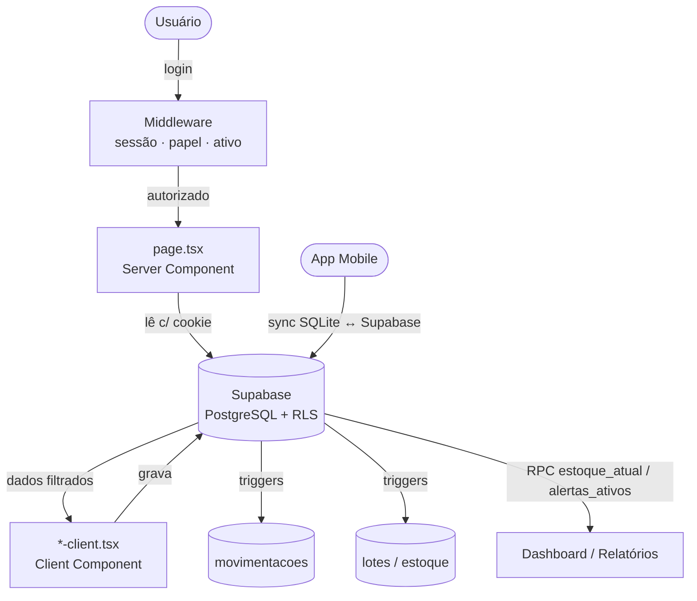

# 01 — Arquitetura

> Documentação técnica do **HtoGestão** — sistema de gestão agrícola (cana-de-açúcar).
> Documento **somente leitura**. Descreve o estado do sistema; não altera comportamento.
> Última revisão: 2026-07-15.

---

## 1. Visão geral

O HtoGestão é um **monorepo** (pnpm workspaces) que entrega três produtos coordenados:

| Pacote | Tecnologia | Papel |
|---|---|---|
| `packages/web` | Next.js 14 (App Router) | Painel principal, usado no navegador e instalável como PWA |
| `packages/mobile` | Expo / React Native | App de campo com banco local (SQLite) e sincronização |
| `packages/shared` | TypeScript puro | Tipos e utilidades compartilhados pelos dois apps |

O backend é o **Supabase** (PostgreSQL + Auth + RLS + funções + Edge Functions). Não existe uma camada de API própria: as telas conversam **diretamente** com o Supabase, e a lógica crítica de negócio (baixa de estoque, cálculos, segurança) vive **dentro do banco**.

```
┌─────────────┐     ┌─────────────┐
│   Web (PWA) │     │ Mobile (App)│
│  Next.js 14 │     │  Expo/RN    │
└──────┬──────┘     └──────┬──────┘
       │  @supabase/ssr    │  @supabase/supabase-js
       │  (cookie)         │  (AsyncStorage)
       └─────────┬─────────┘
                 ▼
        ┌──────────────────┐
        │     SUPABASE     │
        │ PostgreSQL + Auth│
        │ RLS · RPC · Edge │
        └──────────────────┘
```

---

## 2. Tecnologias utilizadas

**Web**
- Next.js `14.2.4` (App Router, React Server Components), React 18, TypeScript 5.4
- Tailwind CSS, Radix UI (dialog, select, dropdown, toast, tabs…), `lucide-react`, Recharts
- `@tanstack/react-query`, `@tanstack/react-table`, `xlsx` (importar/exportar Excel)
- `@supabase/ssr` (sessão por cookie no servidor e no cliente), `@supabase/supabase-js`
- PWA (manifest + service worker de offline)

**Mobile**
- Expo `~51`, `expo-router`, React Native `0.74`
- `expo-sqlite` (banco local offline), `zustand` (estado), `react-native-paper` (UI)
- `expo-print` / `expo-sharing` (PDF), `expo-document-picker`, `expo-file-system`
- `@react-native-async-storage/async-storage` (persistência da sessão Supabase)

**Compartilhado**
- `@agro/shared`: `types/enums.ts`, `types/models.ts`, `utils/date.ts`

**Backend / Infra**
- Supabase (PostgreSQL, Auth, Row Level Security, RPC, Edge Functions em Deno)
- Vercel (Hobby) — deploy automático da web na branch `main`
- GitHub `htogestao/hto-gestao` (repositório público)
- pnpm workspaces (monorepo)

---

## 3. Organização das pastas

```
agro-system/
├── package.json                 # scripts do monorepo (dev:web, build:web, type-check…)
├── pnpm-workspace.yaml
├── .gitignore                   # ignora node_modules, .next, .env*.local, temporários
├── README.md
├── docs/                        # ESTA documentação
├── supabase/
│   ├── migrations/
│   │   ├── 001_tables.sql       # schema-núcleo (tabelas, PK, FK, CHECK, índices)
│   │   ├── 002_rls.sql          # Row Level Security + current_user_role() + lotes_field_view
│   │   ├── 003_functions.sql    # estoque_atual, lotes_por_vencimento, encerrar_aplicacao, alertas_ativos
│   │   └── 004_talhoes_cana.sql # colunas extras de cana
│   ├── functions/
│   │   └── import-inventario/   # Edge Function (Deno): importa planilha SIG
│   └── seed.sql                 # dados iniciais
└── packages/
    ├── shared/src/
    │   ├── types/{enums,models}.ts
    │   └── utils/date.ts
    ├── web/
    │   ├── app/
    │   │   ├── (auth)/login/                 # rota pública
    │   │   ├── (dashboard)/                  # rotas protegidas (14 módulos)
    │   │   │   ├── dashboard/  fazendas/  talhoes/
    │   │   │   ├── defensivos/ estoque/   compras/
    │   │   │   ├── aplicacoes/ movimentacoes/ inventario/
    │   │   │   ├── relatorios/ importar/  exportar/
    │   │   │   └── usuarios/   perfil/
    │   │   ├── layout.tsx  manifest.ts  offline/  pwa-register.tsx
    │   ├── src/
    │   │   ├── components/  (sidebar, alertas-card, grafico-estoque, backup-reminder, ui/)
    │   │   └── lib/supabase/{client,server}.ts
    │   ├── middleware.ts        # porteiro de rotas (sessão, papel, ativo)
    │   ├── next.config.mjs
    │   └── vercel.json
    └── mobile/
        ├── app/  (login, tabs, nova-aplicacao, encerrar-aplicacao)
        └── src/services/{supabase,sync}.ts · src/store/useStore.ts
```

**Convenção de cada módulo web:** `page.tsx` (Server Component — busca dados) + `*-client.tsx` (Client Component — interface e escrita). Consistente em todos os módulos.

---

## 4. Camadas e responsabilidades

| Camada | Onde | Responsabilidade |
|---|---|---|
| Porteiro | `middleware.ts` | Verifica sessão, se o usuário está `ativo`, e o papel antes de qualquer rota carregar |
| Busca (servidor) | `page.tsx` | Roda no servidor, lê do Supabase com o cookie (RLS filtra), entrega dados prontos |
| Interface (cliente) | `*-client.tsx` | Renderiza, valida no front, e grava direto no Supabase pelo navegador |
| Regras de negócio | PostgreSQL (triggers, RPC) | Baixa de estoque, FEFO, devolução de sobra, ajuste de inventário, alertas |
| Segurança | RLS + `current_user_role()` | Decide, por papel, o que cada usuário lê e grava |
| Tipos | `@agro/shared` | Contrato único de dados entre web e mobile |

---

## 5. Fluxo entre Frontend, Backend e Supabase

1. **Middleware** intercepta a rota → confere sessão/papel/ativo.
2. **`page.tsx`** (servidor) abre um cliente Supabase com o cookie do usuário e lê os dados já filtrados pela RLS.
3. **`*-client.tsx`** (navegador) exibe e, ao salvar, grava direto no Supabase (cliente browser).
4. **Gatilhos e RPC** no banco reagem: descontam estoque, registram movimentação, calculam alertas.
5. A resposta volta e a UI é atualizada (`router.refresh()` / estado local).

> **Consequência arquitetural:** toda a segurança depende da **RLS estar correta**. É um desenho enxuto e rápido, mas exige rigor nas políticas do banco (ver `08-Seguranca.md`).

---

## 6. Fluxograma geral do sistema



---

## 7. Documentos relacionados

- `02-Banco-de-Dados.md` — tabelas, índices, views, functions, RPCs, triggers, policies
- `03-DER.md` — diagrama entidade-relacionamento
- `04-Fluxo-dos-Modulos.md` — cada módulo e suas dependências
- `05-Regras-de-Negocio.md` — regras extraídas do código
- `06-Infraestrutura.md` — variáveis de ambiente e integrações
- `07-Deploy.md` — fluxo de deploy
- `08-Seguranca.md` — autenticação e autorização
- `09-Roadmap.md` — fluxogramas consolidados e evolução técnica

---

<sub>← [MASTER](MASTER.md) · [⌂ MASTER](MASTER.md) · [02 — Banco de Dados →](02-Banco-de-Dados.md)</sub>
