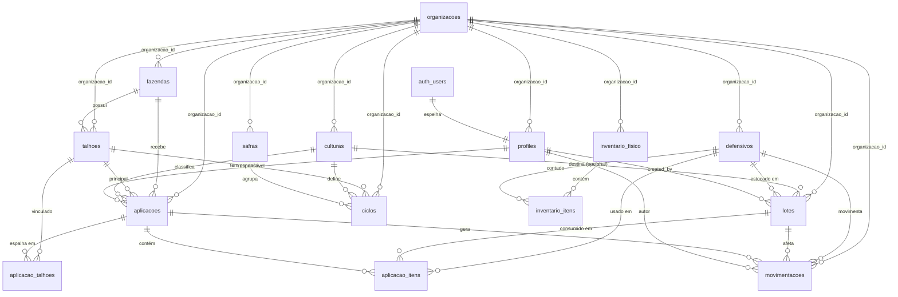
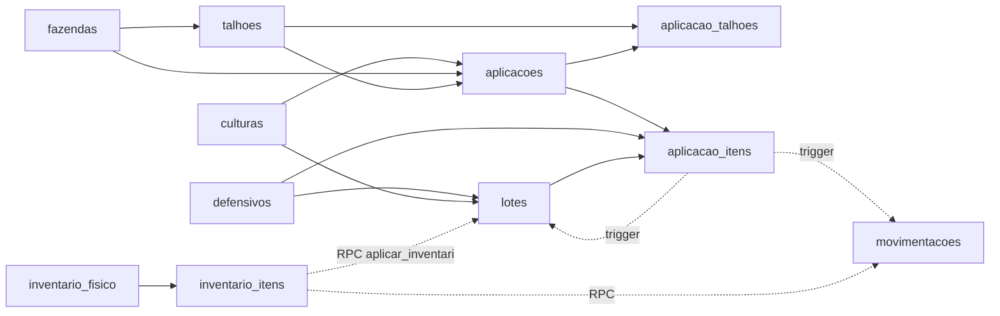

# 03 — DER (Diagrama Entidade-Relacionamento)

> Relacionamentos entre as tabelas do HtoGestão. Somente leitura.

---

## 1. Diagrama (Mermaid)



---

## 2. Cardinalidades e chaves

| Relacionamento | Cardinalidade | Chave estrangeira | ON DELETE |
|---|---|---|---|
| `fazendas` → `talhoes` | 1 : N | `talhoes.fazenda_id` | CASCADE |
| `talhoes` → `aplicacoes` (principal) | 1 : N | `aplicacoes.talhao_id` | — |
| `talhoes` ↔ `aplicacoes` (N:N) | N : N | `aplicacao_talhoes(aplicacao_id, talhao_id)` | CASCADE (aplicacao) |
| `fazendas` → `aplicacoes` | 1 : N | `aplicacoes.fazenda_id` | — |
| `defensivos` → `lotes` | 1 : N | `lotes.defensivo_id` | — |
| `lotes` → `aplicacao_itens` | 1 : N | `aplicacao_itens.lote_id` (nullable) | — |
| `aplicacoes` → `aplicacao_itens` | 1 : N | `aplicacao_itens.aplicacao_id` | CASCADE |
| `aplicacoes` → `movimentacoes` | 1 : N | `movimentacoes.aplicacao_id` | — |
| `defensivos` → `movimentacoes` | 1 : N | `movimentacoes.defensivo_id` | — |
| `lotes` → `movimentacoes` | 1 : N | `movimentacoes.lote_id` | — |
| `talhoes` → `ciclos` | 1 : N | `ciclos.talhao_id` | CASCADE |
| `safras` → `ciclos` | 1 : N | `ciclos.safra_id` | — |
| `culturas` → `ciclos` | 1 : N | `ciclos.cultura_id` | — |
| `culturas` → `aplicacoes` | 1 : N | `aplicacoes.cultura_id` (NOT NULL) | — |
| `culturas` → `lotes` | 1 : N | `lotes.cultura_id` (nullable) | — |
| `profiles` → `aplicacoes` | 1 : N | `aplicacoes.responsavel_id` | — |
| `inventario_fisico` → `inventario_itens` | 1 : N | `inventario_itens.inventario_id` | — |
| `organizacoes` → profiles, fazendas, talhoes, defensivos, lotes, aplicacoes, movimentacoes, inventario_fisico, culturas, safras, ciclos | 1 : N | `*.organizacao_id` **(avulso — não versionado)** | — |

---

## 3. Regra de modelagem central — Cultura por Ciclo

A cultura **não pertence ao talhão diretamente**. Ela pertence ao par **talhão × safra**, materializado na tabela `ciclos`:

```
talhao ──┐
         ├──> ciclo ──> cultura
safra ───┘            (nesta safra, este talhão é desta cultura)
```

Isso permite **rotação de culturas** (o mesmo talhão ser cana numa safra e soja na seguinte). O campo `talhoes.cultura_atual` (texto) é um resquício denormalizado — a fonte estruturada é `ciclos`.

---

## 4. Fluxograma do banco (dependências de escrita)



Linhas contínuas = FK direta. Linhas tracejadas = efeito automático (trigger/RPC).

---

## 5. Tabelas "folha" e "raiz"

- **Raízes** (ninguém aponta para elas por FK de dados de negócio, tudo nasce delas): `defensivos`, `fazendas`, `culturas`, `safras`, `organizacoes`.
- **Centrais** (mais acopladas): `lotes`, `aplicacoes`, `aplicacao_itens`.
- **Folhas** (consomem, ninguém depende): `movimentacoes` (auditoria), e conceitualmente Dashboard/Relatórios (não são tabelas).

---

<sub>← [02 — Banco de Dados](02-Banco-de-Dados.md) · [⌂ MASTER](MASTER.md) · [04 — Fluxo dos Módulos →](04-Fluxo-dos-Modulos.md)</sub>
