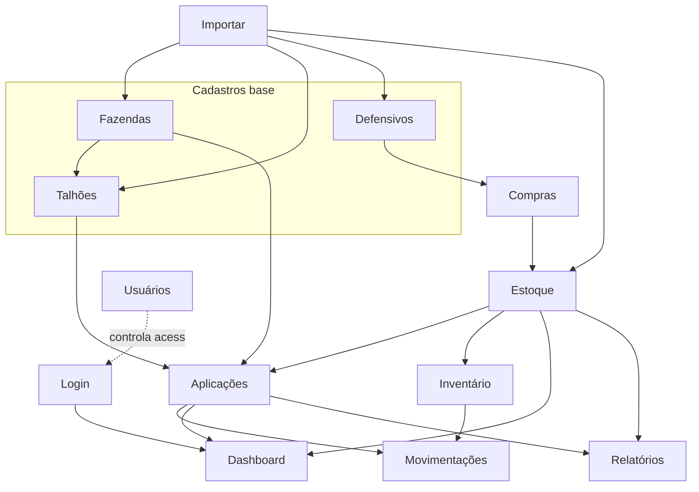
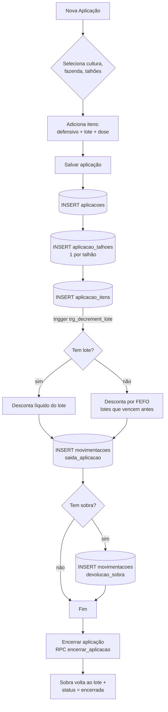

# 04 — Fluxo dos Módulos

> Responsabilidade de cada módulo, dependência entre telas e entre dados. Somente leitura.

---

## 1. Módulos existentes (telas)

Cada módulo web segue o par `page.tsx` (servidor) + `*-client.tsx` (cliente).

| Módulo | Rota | Papéis com acesso | Escreve em | Lê de |
|---|---|---|---|---|
| Dashboard | `/dashboard` | todos | — | RPC `estoque_atual`, `alertas_ativos`, aplicações, lotes |
| Fazendas | `/fazendas` | todos (edição: admin/viewer/field [avulso]) | `fazendas` | `fazendas` |
| Talhões | `/talhoes` · `/talhoes/[id]/historico` | todos | `talhoes` | `talhoes`, `fazendas`, `aplicacoes` |
| Defensivos | `/defensivos` | oculto p/ field | `defensivos` | `defensivos`, `aplicacao_itens`, `movimentacoes`, `lotes` |
| Estoque & Lotes | `/estoque` | todos | `lotes` | RPC `estoque_atual`, `lotes` |
| Compras (NFs) | `/compras` | oculto p/ field | `lotes`, `movimentacoes` | `lotes`, `defensivos`, `culturas` |
| Aplicações | `/aplicacoes` · `/nova` · `/[id]/editar` | todos | `aplicacoes`, `aplicacao_itens`, `aplicacao_talhoes` | fazendas, talhoes, defensivos, lotes, culturas |
| Movimentações | `/movimentacoes` | todos | — (gerado por trigger) | `movimentacoes` |
| Inventário | `/inventario` · `/novo` | todos | `inventario_fisico`, `inventario_itens` + RPC `aplicar_inventario` | RPC `estoque_atual` |
| Relatórios | `/relatorios` | todos | — | lotes, aplicações, culturas + RPC |
| Importar | `/importar` | somente admin | fazendas, talhoes, defensivos, lotes | — |
| Exportar | `/exportar` | oculto p/ field | — | quase todas |
| Usuários | `/usuarios` | somente admin | `profiles` | `profiles` |
| Meu Perfil | `/perfil` | todos | `profiles` (próprio) | `profiles` |

---

## 2. Módulos citados que NÃO existem como tela

| Item | Situação | Observação para Sprint 2 |
|---|---|---|
| **Culturas** | Existe como **dado** (`culturas`, `ciclos`) e filtro; sem tela de gestão | Candidata a nova tela CRUD |
| **Adubos** | Não existe módulo; são **classes** de `defensivos` | Separar exigiria decisão de produto |
| **Configurações** | Não existe; há apenas `Meu Perfil` | Candidata (safra ativa, parâmetros de alerta, dados da empresa) |
| **Permissões** | Não é tela; é **mecanismo** (middleware + RLS + sidebar) | Ver `08-Seguranca.md` |

---

## 3. Dependência entre telas

**Leitura:** os cadastros base (Fazendas, Talhões, Defensivos) são pré-requisito. Compras abastece o Estoque, que habilita Aplicações. Aplicações e Inventário alimentam Movimentações. Dashboard e Relatórios são consumidores finais.

---

## 4. Dependência entre módulos — quem envia / consome / impacto

| Módulo | Envia informações para | Consome informações de | Se deixasse de existir |
|---|---|---|---|
| Fazendas | Talhões, Aplicações, Relatórios | — | Colapsa a hierarquia física |
| Talhões | Aplicações, Ciclos, Histórico, Relatórios | Fazendas, Culturas | Some o "onde" das aplicações |
| Culturas | Aplicações, Compras, Relatórios, Ciclos | — | Perde o fatiamento por cultura |
| Defensivos | Lotes, Aplicações, Estoque, Movimentações | — | Sistema para: sem produto não há estoque |
| Compras | Lotes → Estoque | Defensivos, Culturas | Estoque nunca entra |
| Estoque/Lotes | Aplicações, Dashboard, Relatórios, Alertas | Compras, Defensivos | Base do sistema; aplicações não descontam |
| Aplicações | Movimentações, Histórico do talhão, Dashboard, Relatórios | Fazendas, Talhões, Culturas, Estoque | Sem consumo nem custo operacional |
| Movimentações | Auditoria, Relatórios | Aplicações, Inventário (via trigger/RPC) | Perde-se o rastro de estoque |
| Inventário | Ajuste de Lotes, Movimentações | Estoque | Divergências físicas não corrigidas |
| Dashboard | — (folha) | Todos + RPCs | Perde visão consolidada |
| Relatórios | — (folha) | Todos | Perde extração |
| Usuários/Permissões | Todos (define acesso) | Supabase Auth | Sem controle de acesso |

---

## 5. Fluxograma do processo de aplicação

> Ao **excluir** um item, o trigger `trg_restore_lote` devolve o líquido ao estoque e registra `devolucao_sobra`.

---

← [03 — DER](03-DER.md) · [⌂ MASTER](MASTER.md) · [05 — Regras de Negócio →](05-Regras-de-Negocio.md)
