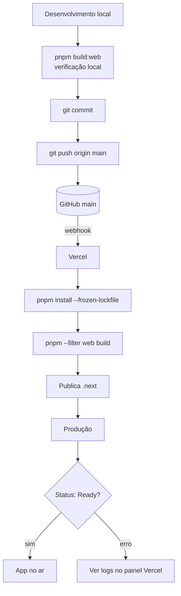
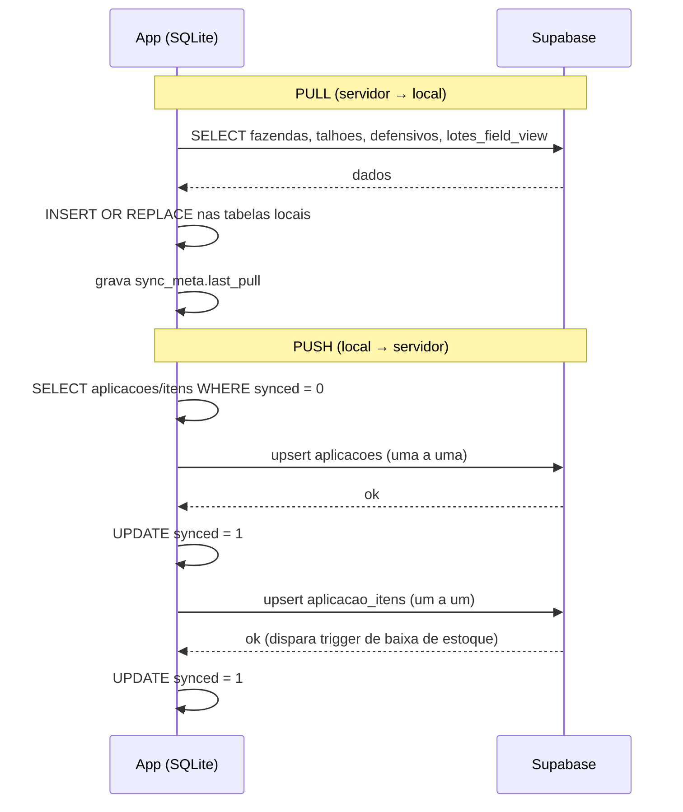

# 07 — Deploy

> Fluxos de deploy da web, do mobile, das Edge Functions e das mudanças de banco. Somente leitura.

---

## 1. Deploy da Web (Vercel)

**Gatilho:** `git push` na branch `main` do repositório `htogestao/hto-gestao`.

**Passos automáticos no Vercel:**
1. Vercel detecta o push via integração GitHub.
2. Executa `installCommand`: `cd ../.. && pnpm install --frozen-lockfile` (instala o monorepo inteiro).
3. Executa `buildCommand`: `cd ../.. && pnpm --filter web build` (build só do pacote web).
4. Publica a saída (`outputDirectory: .next`).
5. Promove para produção (branch `main`).

> Como `ignoreBuildErrors`/`ignoreDuringBuilds` estão `true`, erros de tipo e lint **não** falham o build. O build local (`pnpm build:web`) é idêntico ao do Vercel — verificá-lo antes do push é a melhor rede de segurança atual.

### Fluxograma do deploy



**Verificação pós-deploy:** confirmar "Status: Ready" no painel do Vercel para o commit; abrir a URL de produção e checar a tela de login. As variáveis `NEXT_PUBLIC_SUPABASE_*` devem estar no painel do Vercel.

---

## 2. Deploy do Mobile (EAS)

```bash
cd packages/mobile
eas login
eas build --platform android --profile preview
```
Gera um **APK Android** instalável diretamente no celular (sem Play Store). Configuração em `eas.json` e `app.json`. Variáveis `EXPO_PUBLIC_SUPABASE_*` embarcadas no build.

---

## 3. Deploy da Edge Function

```bash
supabase login
supabase link --project-ref <SEU_PROJECT_REF>   # obtenha no painel do Supabase
supabase functions deploy import-inventario
```
As variáveis `SUPABASE_URL` e `SUPABASE_SERVICE_ROLE_KEY` são fornecidas pelo ambiente do Supabase.

---

## 4. Mudanças de banco (processo atual)

- O schema-núcleo está versionado em `supabase/migrations/001–004`.
- **Mudanças posteriores** são aplicadas **manualmente**: cola-se o SQL no **Supabase SQL Editor** e executa-se. Esses SQLs ficam em arquivos avulsos (fora do repositório).
- **Recomendação (não executada):** adotar o Supabase CLI (`supabase db pull`) para versionar o estado atual e passar a versionar cada mudança — ver `09-Roadmap.md`.

> ⚠️ **Cuidado:** entre os SQLs avulsos há um script destrutivo (`limpar_lotes_duplicados.sql`) que apaga `movimentacoes` e `lotes`. Não deve ser executado como parte de um deploy.

---

## 5. Fluxo de sincronização mobile

O app de campo funciona offline (SQLite local) e sincroniza quando há rede. Estratégia **pull-first**, depois push das pendências.



**Regras de conflito (atual):** server vence para fazendas/defensivos; local vence para aplicações. `countPending()` informa quantos registros aguardam envio.

> **Deriva conhecida:** o schema local do mobile ainda **não** contempla `cultura_id` nem os campos novos de aplicação (operador, equipamento, clima). O app grava um subconjunto.

---

<sub>← [06 — Infraestrutura](06-Infraestrutura.md) · [⌂ MASTER](MASTER.md) · [08 — Segurança →](08-Seguranca.md)</sub>
