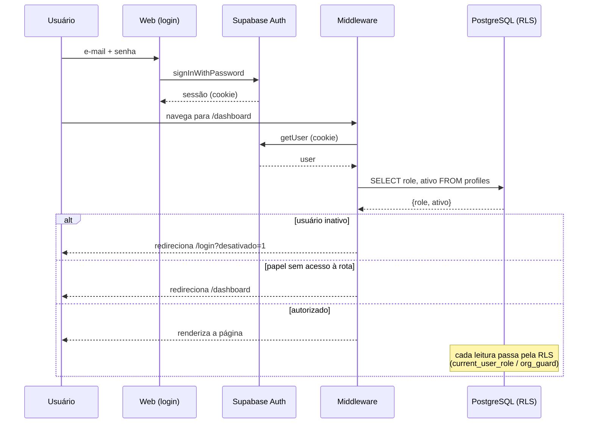

# 08 — Segurança

> Autenticação, autorização, RLS e fluxo de login. Somente leitura.
> Nomes de `.sql` marcados **[avulso]** foram aplicados manualmente e **não estão no repositório** (ver convenção em `02-Banco-de-Dados.md`).

---

## 1. Autenticação

- **Provedor:** Supabase Auth (e-mail + senha).
- **Web:** sessão por **cookie** via `@supabase/ssr`. O servidor (`page.tsx`, `middleware.ts`) e o navegador (`*-client.tsx`) leem a mesma sessão pelo cookie.
- **Mobile:** sessão persistida em `AsyncStorage` (`autoRefreshToken: true`, `persistSession: true`).
- **Criação de perfil:** ao registrar um usuário no Auth, o gatilho `handle_new_user()` cria a linha em `profiles` com papel padrão `field`.

---

## 2. Autorização — 3 camadas (defesa em profundidade)

| Camada | Onde | O que faz |
|---|---|---|
| **1. Rota** | `middleware.ts` | Bloqueia acesso à rota por papel e por usuário desativado, antes de renderizar |
| **2. Dado** | RLS no PostgreSQL | Bloqueia leitura/escrita de linhas por papel (e por empresa via `org_guard`) |
| **3. Interface** | `sidebar.tsx` | Esconde itens de menu que o papel não pode usar (cosmético) |

> A camada **2 (RLS)** é a que realmente protege os dados. As camadas 1 e 3 melhoram a experiência, mas não substituem a RLS.

### Papéis
| Papel | Nome de negócio | Resumo |
|---|---|---|
| `admin` | Analista / Supervisor | Acesso total |
| `viewer` | Patrão / Produtor | Leitura ampla + algumas escritas (fazendas, defensivos, lotes) |
| `field` | Líder / Operador de campo | Opera aplicações próprias; a interface **não exibe** preços/valores (por convenção — ver seção 4, `lotes`, para a ressalva importante) |

---

## 3. Middleware (`packages/web/middleware.ts`)

Lógica (na ordem):
1. Cria cliente Supabase com os cookies do request; obtém `user`.
2. Busca `profiles.role` e `profiles.ativo` do usuário.
3. Regras de redirecionamento:
   - Sem usuário em rota protegida → `/login`.
   - Usuário **desativado** (`ativo = false`) em qualquer rota exceto login → `/login?desativado=1`.
   - Usuário logado e ativo acessando `/login` → `/dashboard`.
   - Papel `field`: só acessa `dashboard`, `aplicacoes`, `movimentacoes`, `estoque`, `fazendas`, `talhoes`, `perfil`, `inventario`, `relatorios`; fora disso → `/dashboard`.
4. `matcher` cobre todas as rotas exceto assets estáticos e `/api`.

Rotas protegidas: `/dashboard`, `/fazendas`, `/talhoes`, `/defensivos`, `/estoque`, `/compras`, `/aplicacoes`, `/movimentacoes`, `/relatorios`, `/importar`, `/exportar`, `/usuarios`, `/perfil`, `/inventario`.

> Observação histórica: havia um `src/middleware.ts` duplicado (re-export quebrado), removido na limpeza estrutural. O middleware oficial é o da raiz de `packages/web`.

---

## 4. RLS — políticas por tabela (migration `002` + fixes avulsos)

Função base: `current_user_role()` (SECURITY DEFINER) retorna o papel do `auth.uid()`.

### profiles
- SELECT: próprio **ou** admin/viewer · INSERT: admin · UPDATE: próprio ou admin · DELETE: admin

### fazendas / talhoes
- SELECT: admin/viewer/field
- INSERT/UPDATE: admin (migration) → **ampliado para admin/viewer/field** por `fix_lider_fazendas_talhoes.sql` **[avulso]**
- DELETE: admin

### defensivos
- SELECT: admin/viewer/field · INSERT/UPDATE/DELETE: admin (migration) → **+viewer** por `fix_defensivos_editar_excluir.sql` **[avulso]**

### lotes
- SELECT: política `lotes_select_admin_viewer` (admin/viewer) **e** `lotes_select_field` (field). ⚠️ **Atenção — a policy do field concede `SELECT` na tabela `lotes` inteira, incluindo `preco_unitario` e `valor_total`.** A view `lotes_field_view` (que omite preços) é usada pela interface por convenção, mas **não impede** um `field` de consultar as colunas de preço direto na tabela, porque a RLS do PostgreSQL controla acesso a **linhas, não a colunas**.
  - **Como está hoje:** a confidencialidade de preço para o campo depende exclusivamente de a UI/mobile não pedir essas colunas.
  - **Mitigação (não implementada — apenas registro):** para impor de fato, seria preciso remover a policy `lotes_select_field` e servir o campo somente pela view, **ou** aplicar column-level privileges (`GRANT SELECT (colunas) ...`) revogando `preco_unitario`/`valor_total` do papel. Decisão de arquitetura a validar.
- INSERT/UPDATE: admin (migration) → **+viewer** por `fix_lotes_permissao.sql` **(avulso — não versionado, ver seção 4 nota)** · DELETE: admin

### aplicacoes
- SELECT: admin/viewer **ou** field onde `responsavel_id = auth.uid()`
- INSERT: admin/field
- UPDATE: admin **ou** field(responsável, `em_andamento`) → **ampliado** para field em qualquer aplicação por `fix_field_editar_aplicacao.sql` **[avulso]**
- DELETE: admin → **+viewer e +field(dono)** por fixes avulsos

### aplicacao_itens
- SELECT: admin/viewer **ou** dono da aplicação
- INSERT/UPDATE/DELETE: admin **ou** field dono da aplicação (`fix_rls_aplicacao_itens.sql` **[avulso]**)

### aplicacao_talhoes **[avulso]**
- SELECT: admin/viewer/field · INSERT: admin/field · DELETE: admin/viewer **ou** dono (`fix_field_editar_aplicacao.sql`)

### movimentacoes
- SELECT: admin/viewer **ou** field(próprio) · INSERT: admin/field · UPDATE/DELETE: admin

### culturas / safras / ciclos **[avulso]**
- SELECT: admin/viewer/field · WRITE: admin/viewer · **`org_guard`** RESTRICTIVE (organizacao_id = current_org())

> **Conflito por ordem:** algumas políticas (ex.: `aplicacoes_delete`) são redefinidas em mais de um SQL avulso. A regra final depende da ordem de aplicação — ver dívida em `09-Roadmap.md`.

---

## 5. Multiempresa (`org_guard`)

- `fn_set_org()` carimba `organizacao_id` em cada INSERT.
- `current_org()` retorna a empresa do usuário.
- `org_guard` (RESTRICTIVE) exige `organizacao_id = current_org()` para toda operação nas tabelas onde foi aplicada (`culturas`, `safras`, `ciclos` confirmados).
- **A confirmar no banco:** se o `org_guard` foi aplicado às tabelas-núcleo (fazendas, talhoes, defensivos, lotes, aplicacoes, movimentacoes) e se `organizacoes` tem RLS. Sem isso, o isolamento entre empresas fica incompleto.

---

## 6. Segurança da Edge Function

`import-inventario` roda com `SUPABASE_SERVICE_ROLE_KEY` (ignora RLS), mas:
1. Exige `Authorization: Bearer <token>` válido (senão 401).
2. Verifica `profiles.role = 'admin'` (senão 403).

A service role key vive apenas no ambiente do Supabase — **nunca** deve ir ao cliente.

---

## 7. Fluxo completo do login

---

## 8. Pontos de atenção de segurança

- **Preço visível ao papel `field` (ver seção 4, `lotes`)** — a proteção de preço para o campo é apenas convenção de interface; a RLS não a impõe. É a lacuna de segurança mais concreta hoje.
- **RLS é o único guarda real dos dados** — políticas erradas vazam ou bloqueiam dados em vários módulos.
- **`org_guard` incompleto (a confirmar)** — risco de vazamento entre empresas se ausente nas tabelas-núcleo.
- **Chave de serviço** — potente; restrita ao ambiente Supabase.
- **`.env.local` versionado** — contém só chaves públicas (`NEXT_PUBLIC_*`), mas o ideal é não versionar (ver dívidas).
- **Type-check desligado** — não é segurança direta, mas remove uma rede de proteção contra bugs.

---

← [07 — Deploy](07-Deploy.md) · [⌂ MASTER](MASTER.md) · [09 — Roadmap →](09-Roadmap.md)
