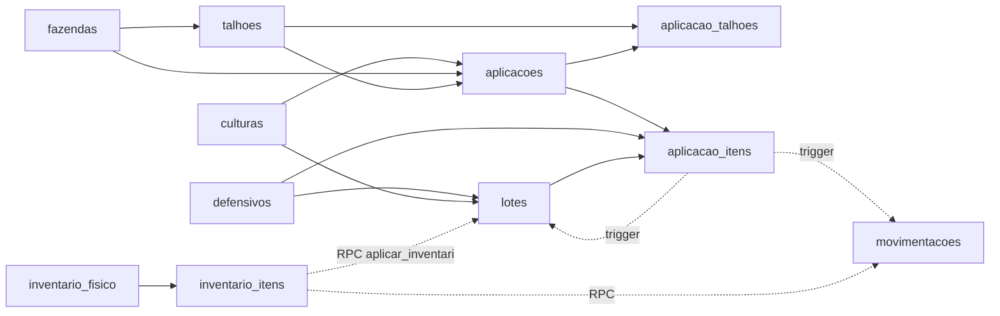
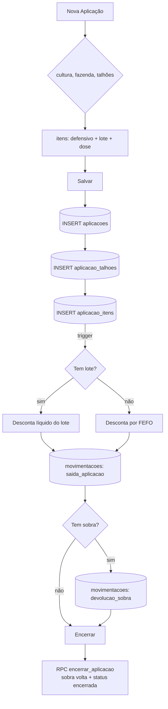
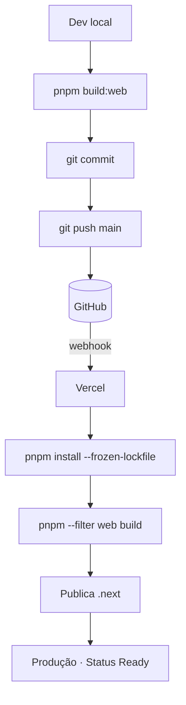
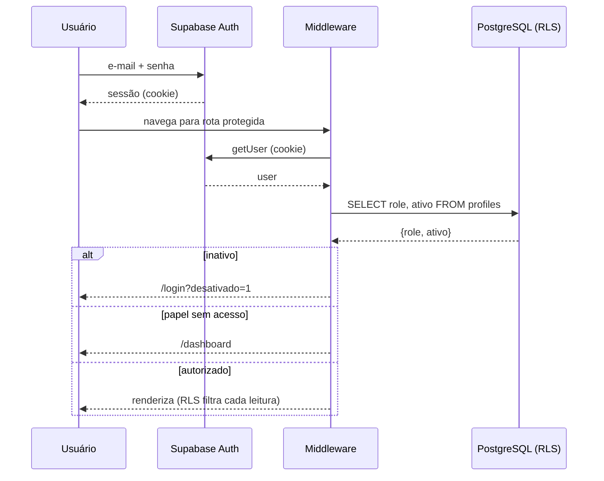

# 09 — Roadmap e Fluxogramas Consolidados

> Fluxogramas do sistema + dívidas técnicas + roadmap de evolução. Somente leitura — nada aqui foi implementado.

---

## Parte A — Fluxogramas

### 1. Fluxograma geral do sistema

### 2. Fluxograma do banco

### 3. Fluxograma do processo de aplicação

### 4. Fluxograma do deploy

### 5. Fluxograma da autenticação

---

## Parte B — Dívidas técnicas

| # | Dívida | Severidade | Detalhe |
|---|---|---|---|
| 1 | Migrations pararam no `004` | 🟡 Parcial | Migrations `005`-`013` já formalizam boa parte do SQL avulso (2026-09-08) + `CONTRIBUTING.md` documenta o processo daqui pra frente. Falta confirmar se sobra algum `fix_*.sql` avulso mencionado em `08-Segurança.md`/`02-Banco-de-Dados.md` (ex.: `fix_lider_fazendas_talhoes.sql`, `fix_defensivos_editar_excluir.sql`) — não encontrados no repo, prováveis candidatos a migration futura |
| 2 | Gatilho de estoque não versionado | 🔴 Alta | Regra mais crítica só no Desktop; evoluiu em 4 arquivos |
| 3 | Sem testes automatizados | 🔴 Alta | Nenhuma cobertura; refatorar é arriscado |
| 4 | Type-check/lint desligados no build | 🔴 Alta | `ignoreBuildErrors`; há erros de tipo pré-existentes (ex.: `Talhao`) |
| 5 | `org_guard` a confirmar nas tabelas-núcleo | 🟡 Média | Risco de vazamento entre empresas se ausente |
| 6 | Duplicação Nova/Editar aplicação | 🟡 Média | Toda mudança feita em dois lugares |
| 7 | Sem camada de acesso a dados | 🟡 Média | Queries Supabase repetidas em cada tela |
| 8 | Deriva do schema mobile | 🟡 Média | SQLite local não conhece `cultura_id`/campos novos |
| 9 | Script destrutivo junto das migrations | 🟡 Média | `limpar_lotes_duplicados.sql` apaga lotes/movimentações |
| 10 | "Custo médio" é só soma | 🟡 Média | Rótulo enganoso; não há média ponderada real |
| 11 | Backup manual | 🟢 Baixa | Sem backup automático |
| 12 | Sem observabilidade | 🟢 Baixa | Sem captura de erros em produção (ex.: Sentry) |
| 13 | Tipos frouxos no banco | 🟢 Baixa | `hora_inicio/fim` como text; classe `biologico` fora do CHECK |
| 14 | Componentes grandes | 🟢 Baixa | Clientes de 500–630 linhas com responsabilidades misturadas |

---

## Parte C — Roadmap técnico sugerido

> Sugestões, sem implementação. Ordenadas por retorno para a evolução do sistema.

### 🔴 Fase 1 — Reconquistar a rede de segurança (fundação)
1. **Retomar migrations versionadas** — `supabase db pull` para fotografar o banco atual; trazer as ~20 mudanças avulsas para `supabase/migrations/`. Resolve dívidas 1, 2, 9.
2. **Versionar o gatilho de baixa de estoque** como migration canônica única.
3. **Corrigir tipos e ligar o type-check** no CI (remover `ignoreBuildErrors`). Resolve dívida 4.
4. **Testes de RLS/isolamento** — provar que empresa A não vê dados de B, a cada deploy. Resolve dívida 5.

### 🟡 Fase 2 — Reduzir acoplamento e preparar features
5. **Camada de acesso a dados** (biblioteca de queries) — dívida 7.
6. **Unificar formulário de aplicação** (Nova/Editar) — dívida 6.
7. **Alinhar schema do mobile** com cultura e campos novos — dívida 8.
8. **Custo médio ponderado real**, se os relatórios financeiros exigirem — dívida 10.
9. **Novas telas da Sprint 2** — Culturas (gestão), Configurações (safra ativa, parâmetros de alerta, dados da empresa) e, se for decisão de produto, Adubos separados de Defensivos.

### 🟢 Fase 3 — Escala e operação
10. **Paginação** nas listas; mover cálculos pesados do Dashboard para o banco (views/RPC).
11. **Observabilidade** (captura de erros) e **backup automático** — dívidas 11, 12.
12. **Tipos estritos no banco** (`time`, `CHECK`, incluir `biologico`) — dívida 13.
13. **Pooler de conexões** e revisão de plano (Vercel/Supabase) para muitos tenants.

---

## Parte D — Índice da documentação

| Doc | Conteúdo |
|---|---|
| `01-Arquitetura.md` | Visão geral, stack, pastas, camadas, fluxo FE/BE/Supabase |
| `02-Banco-de-Dados.md` | Tabelas, índices, views, functions, RPCs, triggers, policies |
| `03-DER.md` | Diagrama entidade-relacionamento e cardinalidades |
| `04-Fluxo-dos-Modulos.md` | Módulos, dependências entre telas e dados |
| `05-Regras-de-Negocio.md` | Regras (RN-01 a RN-15) com origem no código |
| `06-Infraestrutura.md` | Variáveis de ambiente, integrações, SPOF |
| `07-Deploy.md` | Deploy web/mobile/edge + sync mobile |
| `08-Seguranca.md` | Auth, autorização, RLS, fluxo de login |
| `09-Roadmap.md` | Este documento — fluxogramas, dívidas, roadmap |

---

## Parte E — Força-tarefa em andamento (checklist ativo)

> Sequência definida em sessão de planejamento (2026-09-08). Ordem fixa — não pular etapas. Cada item vira `[x]` quando concluído e verificado, não quando só "codado".

### 1. Fechar pendências já prontas
- [x] Commit + push do seletor de organização (migration `012` + UI no sidebar) → deploy Vercel
- [x] Cadastrar estoque inicial da AGRO MÁXIMO: 11 defensivos + lotes correspondentes

### 2. Dívidas de estoque represadas (bloqueiam confiança no dado antes do adubo)
- [x] Investigar **causa raiz** do bug de estoque subestimado (86 lotes zerados, carga de 08/06/2026) — `git log` descartou o código versionado (nenhum commit tocou `importarDefensivos()` entre 31/05 e o incidente); origem = script SQL avulso não versionado. Ajuste retroativo de +6.023 un lançado como `ajuste` no razão (`supabase/ajuste_retroativo_86_lotes_jun2026.sql`), proporcional por lote, observação documentando que é estimativa pendente de confirmação física.
- [x] Import de estoque de **defensivos** (`importarDefensivos`) corrigido: reimportar agora **substitui** o lote "Estoque inicial"/"VENCIDO" existente por produto, em vez de duplicar.
- [ ] Import de **fazendas/talhões** via Edge Function `import-inventario` — mesmo padrão de duplicação não verificado ainda (fora do escopo desta rodada, que era só defensivos/lotes)

### 2.1 Incidente de segurança — senha exposta (resolvido 2026-09-08)
- [x] `supabase/seed.sql` tinha senha em texto plano (`auth.users` inserido direto) commitada desde o primeiro commit, em repositório **público** — achado durante o levantamento de SQL solto.
- [x] 3 usuários fake removidos de `auth.users` em produção (sem dado dependente — auditado: 0 perfis órfãos, 0 referências residuais em nenhuma coluna `uuid` do schema `public`).
- [x] Histórico do git reescrito via BFG Repo-Cleaner (`git filter-repo` indisponível no ambiente) — senha eliminada de todos os commits e mensagens; force-push aplicado. **Ressalva:** GitHub pode manter o commit antigo acessível por hash direto por um tempo (GC não é instantâneo) — mitigação real é rotação de credencial, não a reescrita em si.
- [x] `seed.sql` recriado com placeholder `CHANGE_ME_BEFORE_RUNNING` em vez de senha literal.
- ⚠️ **Lembrete permanente:** se `Agro@2025!` foi reaproveitada em qualquer conta real, trocar manualmente — impossível verificar isso remotamente.

### 2.2 Vazamento de dado entre empresas (crítico — resolvido 2026-09-08)
- [x] **Achado:** `estoque_atual()`, `alertas_ativos()`, `lotes_por_vencimento()`, `encerrar_aplicacao()` e `aplicar_inventario()` são `SECURITY DEFINER` (ignoram RLS por definição) e nunca filtravam por `organizacao_id` — escritas antes do multiempresa existir. Vazamento confirmado: usuário via 241 defensivos (230 Agrícola MV + 11 AGRO MÁXIMO) no Dashboard/Estoque/Relatórios/Exportar/Inventário. As duas últimas também permitiam **escrever** em empresa errada (encerrar aplicação ou aplicar ajuste de estoque de outra empresa, sabendo o UUID).
- [x] **Alcance real:** só 2 empresas no sistema; usuário da AGRO MÁXIMO nunca logou — nenhum cliente real chegou a ver o vazamento, só apareceu em teste do seletor de empresa.
- [x] **Corrigido:** `014_fix_vazamento_org_rpcs.sql` — todas as 5 funções + as 2 triggers de baixa/devolução (defesa em profundidade) agora filtram por `current_org()`. Testado simulando as duas empresas via `request.jwt.claims`: cada uma vê só o próprio número (11 / 230).
- [x] `CONTRIBUTING.md` ganhou checklist obrigatório pra função `SECURITY DEFINER` nova, pra não repetir isso.

### 3. SQL solto versionado + processo (concluído 2026-09-08)
- [x] `013_operacao_aplicacoes.sql` formaliza `aplicacoes.operacao` (já em produção, `IF NOT EXISTS`, testada sem erro)
- [x] Rascunhos redundantes removidos (`add_horimetro_aplicacoes.sql`, `sprint1_views_v1_v4.sql`, `add_operacao_aplicacoes.sql` — conteúdo já capturado em `005`, `007`, `013`)
- [x] `CONTRIBUTING.md` criado — regra: todo SQL de schema vira migration commitada antes de rodar em produção; scripts de dado de cliente ficam em `supabase/` com cabeçalho "já rodou, não reexecutar"
- [x] `supabase/config.toml` e `supabase/.gitignore` versionados

### 5. Adubo como classe de defensivo (kg/ha) — concluído 2026-09-08
- [x] Dose/retirada/sobra já eram numérico livre com unidade dinâmica por produto (`def.unidade`) em toda a base — web, mobile e custo (views V1-V4). Zero mudança de schema necessária nesse ponto.
- [x] Classe `corretivo_solo` criada (migration `015`) — separa calcário/gesso de fertilizante de verdade (ureia, KCl) nos relatórios.
- [x] Seletor kg/ton por item em Nova Aplicação, Editar Aplicação (web) e Nova Aplicação (mobile) — "ton" só existe na tela, convertido pra kg antes de gravar. Trocar o toggle converte o número já digitado (não reinterpreta). Testado de verdade: INSERT simulado (1 ton/ha × 2 ha) decrementou o lote de 5000kg pra 3000kg via o trigger real de baixa de estoque, sem misturar grandezas.
- [x] Custo por hectare: nada novo construído, como previsto — RPC `indicadores_custo` + views V1-V4 já cobrem; adubo entra automático assim que virar `defensivo` com `lote`.

### 4. Débitos de segurança/técnicos (depois — não bloqueiam os itens acima)
- [ ] Ligar `inventario_fisico`/`inventario_itens` à UI (RPC `aplicar_inventario` já existe e funciona)
- [ ] Fechar exposição de preço pro papel `field` via `lotes` (rotear para `lotes_field_view`)
- [ ] Consolidar migrations `001`–`012` vs. SQL avulso — banco de produção hoje não é 100% reproduzível do zero só com o repositório

---

> **Nota de escopo (atualizada 2026-09-08):** as Partes A-D acima descrevem o estado observado até a análise original — não são mais 100% atuais (migrations `005`–`012` já foram aplicadas desde então: multiempresa, views de custo, RPC de indicadores, catálogo ADAPAR, seletor de organização). A Parte E é a fonte viva de "o que falta agora"; Partes A-D continuam válidas como referência de arquitetura e dívidas de origem.

---

← [08 — Segurança](08-Seguranca.md) · [⌂ MASTER](MASTER.md) · [Engineering →](ENGINEERING.md)
