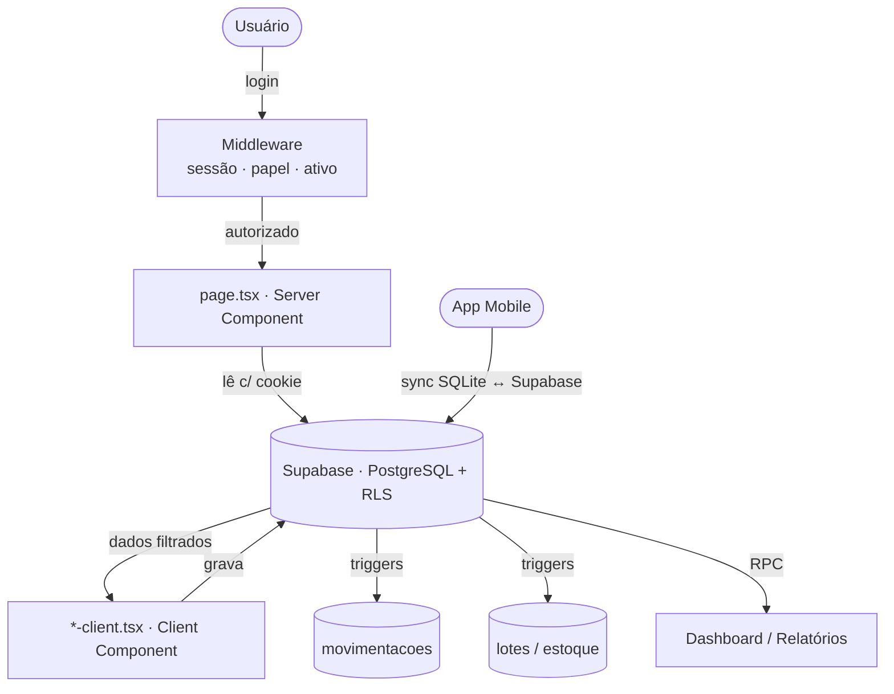
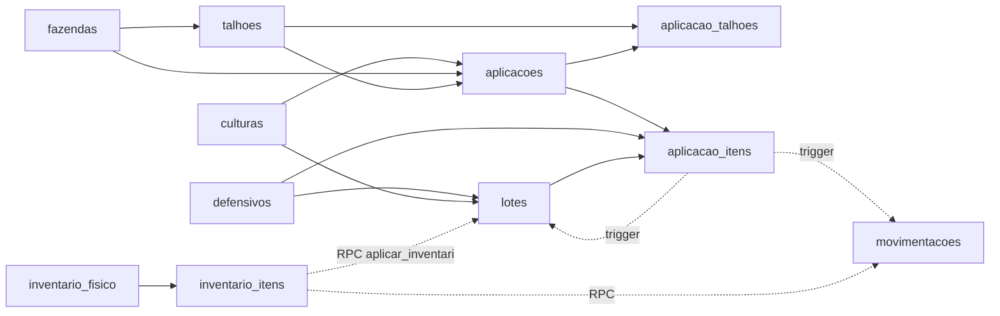
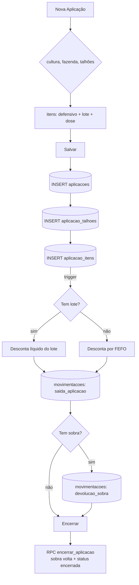
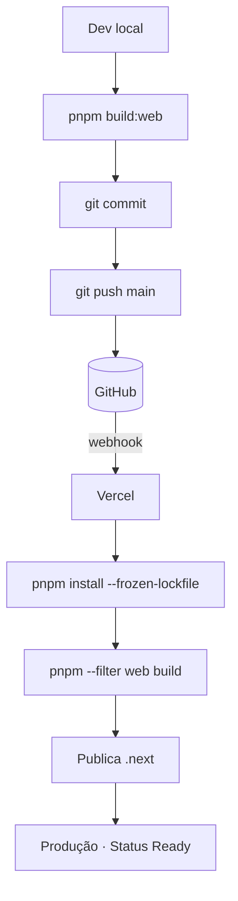
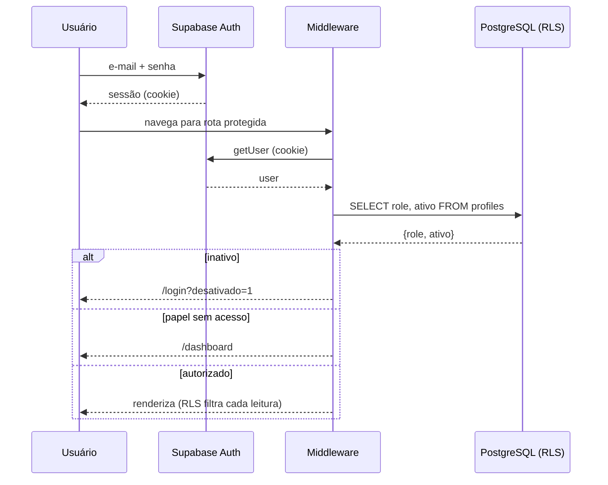

# 09 — Roadmap e Fluxogramas Consolidados

> Fluxogramas do sistema + dívidas técnicas + roadmap de evolução. Somente leitura — nada aqui foi implementado.

---

## Parte A — Fluxogramas

### 1. Fluxograma geral do sistema

### 2. Fluxograma do banco

### 3. Fluxograma do processo de aplicação

### 4. Fluxograma do deploy

### 5. Fluxograma da autenticação

---

## Parte B — Dívidas técnicas

| # | Dívida | Severidade | Detalhe |
|---|---|---|---|
| 1 | Migrations pararam no `004` | 🔴 Alta | ~20 mudanças posteriores vivem só em SQL avulso + banco; não reproduzível pelo repo |
| 2 | Gatilho de estoque não versionado | 🔴 Alta | Regra mais crítica só no Desktop; evoluiu em 4 arquivos |
| 3 | Sem testes automatizados | 🔴 Alta | Nenhuma cobertura; refatorar é arriscado |
| 4 | Type-check/lint desligados no build | 🔴 Alta | `ignoreBuildErrors`; há erros de tipo pré-existentes (ex.: `Talhao`) |
| 5 | `org_guard` a confirmar nas tabelas-núcleo | 🟡 Média | Risco de vazamento entre empresas se ausente |
| 6 | Duplicação Nova/Editar aplicação | 🟡 Média | Toda mudança feita em dois lugares |
| 7 | Sem camada de acesso a dados | 🟡 Média | Queries Supabase repetidas em cada tela |
| 8 | Deriva do schema mobile | 🟡 Média | SQLite local não conhece `cultura_id`/campos novos |
| 9 | Script destrutivo junto das migrations | 🟡 Média | `limpar_lotes_duplicados.sql` apaga lotes/movimentações |
| 10 | "Custo médio" é só soma | 🟡 Média | Rótulo enganoso; não há média ponderada real |
| 11 | Backup manual | 🟢 Baixa | Sem backup automático |
| 12 | Sem observabilidade | 🟢 Baixa | Sem captura de erros em produção (ex.: Sentry) |
| 13 | Tipos frouxos no banco | 🟢 Baixa | `hora_inicio/fim` como text; classe `biologico` fora do CHECK |
| 14 | Componentes grandes | 🟢 Baixa | Clientes de 500–630 linhas com responsabilidades misturadas |

---

## Parte C — Roadmap técnico sugerido

> Sugestões, sem implementação. Ordenadas por retorno para a evolução do sistema.

### 🔴 Fase 1 — Reconquistar a rede de segurança (fundação)
1. **Retomar migrations versionadas** — `supabase db pull` para fotografar o banco atual; trazer as ~20 mudanças avulsas para `supabase/migrations/`. Resolve dívidas 1, 2, 9.
2. **Versionar o gatilho de baixa de estoque** como migration canônica única.
3. **Corrigir tipos e ligar o type-check** no CI (remover `ignoreBuildErrors`). Resolve dívida 4.
4. **Testes de RLS/isolamento** — provar que empresa A não vê dados de B, a cada deploy. Resolve dívida 5.

### 🟡 Fase 2 — Reduzir acoplamento e preparar features
5. **Camada de acesso a dados** (biblioteca de queries) — dívida 7.
6. **Unificar formulário de aplicação** (Nova/Editar) — dívida 6.
7. **Alinhar schema do mobile** com cultura e campos novos — dívida 8.
8. **Custo médio ponderado real**, se os relatórios financeiros exigirem — dívida 10.
9. **Novas telas da Sprint 2** — Culturas (gestão), Configurações (safra ativa, parâmetros de alerta, dados da empresa) e, se for decisão de produto, Adubos separados de Defensivos.

### 🟢 Fase 3 — Escala e operação
10. **Paginação** nas listas; mover cálculos pesados do Dashboard para o banco (views/RPC).
11. **Observabilidade** (captura de erros) e **backup automático** — dívidas 11, 12.
12. **Tipos estritos no banco** (`time`, `CHECK`, incluir `biologico`) — dívida 13.
13. **Pooler de conexões** e revisão de plano (Vercel/Supabase) para muitos tenants.

---

## Parte D — Índice da documentação

| Doc | Conteúdo |
|---|---|
| `01-Arquitetura.md` | Visão geral, stack, pastas, camadas, fluxo FE/BE/Supabase |
| `02-Banco-de-Dados.md` | Tabelas, índices, views, functions, RPCs, triggers, policies |
| `03-DER.md` | Diagrama entidade-relacionamento e cardinalidades |
| `04-Fluxo-dos-Modulos.md` | Módulos, dependências entre telas e dados |
| `05-Regras-de-Negocio.md` | Regras (RN-01 a RN-15) com origem no código |
| `06-Infraestrutura.md` | Variáveis de ambiente, integrações, SPOF |
| `07-Deploy.md` | Deploy web/mobile/edge + sync mobile |
| `08-Seguranca.md` | Auth, autorização, RLS, fluxo de login |
| `09-Roadmap.md` | Este documento — fluxogramas, dívidas, roadmap |

---

> **Nota de escopo:** esta documentação é 100% observacional. Nenhum arquivo de código, banco, migration ou configuração foi alterado. Itens marcados "a confirmar no banco" dependem de acesso ao Supabase, não disponível nesta análise.

---

← [08 — Segurança](08-Seguranca.md) · [⌂ MASTER](MASTER.md) · [Engineering →](ENGINEERING.md)
