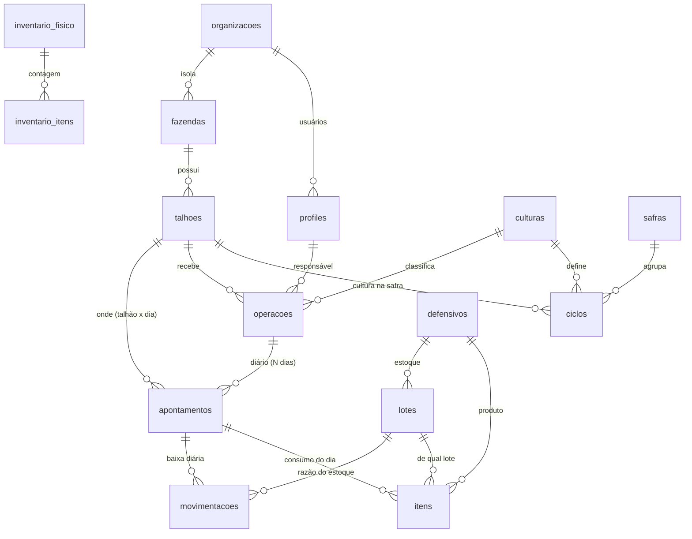

# DOMAIN — Modelo de Domínio Definitivo

> **Referência oficial** do domínio do HtoGestão. Toda implementação futura deve respeitar este documento.
> Estado: proposta congelada para revisão. Modo de criação: somente leitura sobre o sistema — nenhum código, migration, banco ou documentação existente foi alterado.
> Alinha e consolida: `01-Arquitetura`, `02-Banco`, `03-DER`, `04-Módulos`, `05-Regras`, `08-Segurança`, `09-Roadmap`, `ENGINEERING`, e as duas análises de evolução (Operação Agrícola + revisão crítica).

---

## 1. Filosofia do domínio

O HtoGestão nasceu **centrado no estoque** (o que entra e sai do quartinho de defensivos). A visão definitiva o reposiciona como **centrado no talhão**.

> **O talhão é a raiz do sistema.** Ele é a unidade de história, de custo e de decisão agronômica. Fazendas agrupam talhões; operações acontecem sobre talhões; produtos são consumidos em talhões; safras são a dimensão de tempo dos talhões. O estoque deixa de ser o centro e passa a ser um **mecanismo de apoio** — importante, mas subordinado à pergunta real do produtor: *“o que aconteceu, quanto custou e o que devo fazer neste talhão?”*

Princípios que guiam todas as decisões:

1. **Fidelidade à realidade do campo.** O modelo fala a língua de quem opera (operação, diário, apontamento, safra, corte), não a língua do sistema (lançamento, registro).
2. **Processo, não evento.** Uma operação é um trabalho que se estende por vários dias; o sistema acompanha seu ciclo de vida, não força um evento pontual.
3. **Não pedir o que já se sabe.** Continuar o trabalho de ontem é adicionar um dia a uma operação aberta — nunca recriar tudo.
4. **Planejado × realizado.** O que se pretendia e o que de fato aconteceu são coisas distintas e ambas têm valor.
5. **A verdade do estoque é sagrada.** A baixa automática e o rastro de movimentações são o coração transacional; qualquer evolução os preserva.
6. **Incentivar boa agronomia.** O sistema informa e nudge-ia boas práticas (rotação de ingrediente ativo), sem induzir a repetição cômoda de produtos.
7. **Genérico por design.** Hoje pulverização; amanhã plantio, adubação, colheita, irrigação — o núcleo não pode presumir “operação = aplicação de defensivo”.

---

## 2. Glossário das entidades

| Termo de negócio | Nome técnico | O que é |
|---|---|---|
| **Organização** | `organizacoes` | A empresa/produtor (tenant). Isola dados entre clientes. |
| **Usuário** | `profiles` | Pessoa com papel: `admin` (analista/supervisor), `viewer` (patrão/produtor), `field` (líder/operador de campo). |
| **Fazenda** | `fazendas` | Propriedade que agrupa talhões. |
| **Talhão** | `talhoes` | **A raiz.** A parcela de terra. Centro da história, do custo e da decisão. |
| **Cultura** | `culturas` | Tipo de cultura (cana, soja, milho…). |
| **Safra** | `safras` | Ciclo temporal (ex.: 2025/2026). Dimensão de tempo. |
| **Ciclo** | `ciclos` | Cultura de um talhão **numa safra** (talhão × safra → cultura). Permite rotação. |
| **Operação** | `operacoes` *(view de `aplicacoes`)* | Um trabalho de vários dias sobre talhão(es), de um **tipo** (pulverização, plantio…), com ciclo de vida. |
| **Apontamento / Diário da Operação** | `operacao_apontamentos` *(novo)* | O registro de **um dia de execução em um talhão**: área, operador, clima, máquina, produtos do dia. |
| **Item do apontamento** | `apontamento_itens` *(hoje `aplicacao_itens`)* | Produto consumido num apontamento. **Dispara a baixa de estoque.** |
| **Produto / Defensivo** | `defensivos` | Catálogo, com **princípio ativo** (rotação), carência, reentrada, classe. |
| **Lote** | `lotes` | Entrada de estoque por NF (quantidade, preço, vencimento). Estoque = soma dos lotes. |
| **Movimentação** | `movimentacoes` | Razão/ledger do estoque (entrada, saída, devolução, ajuste, descarte). |
| **Inventário** | `inventario_fisico` / `inventario_itens` | Contagem física que ajusta o estoque. |
| **Alvo** *(futuro)* | `alvos` | Praga/daninha/doença por cultura — hoje texto livre `praga_alvo`. |
| **Ordem de Operação** *(futuro)* | — | Planejamento formal; hoje representado por campos de plano na própria operação. |

---

## 3. Fluxo completo do negócio

```
Planejar → Abrir Operação → Apontar o dia (N vezes) → Encerrar → Consolidar
```

1. **Planejamento (leve).** Define-se o que fazer: tipo de operação, talhão(es), alvo, área e dose previstas, janela de datas, responsável. A operação nasce com status `planejada` (ou já `em_andamento`).
2. **Abertura da operação.** A operação passa a `em_andamento`. É o “processo aberto”.
3. **Apontamento diário.** A cada dia de trabalho, registra-se um **apontamento por talhão**: área realizada, área operacional (com acréscimo configurável), operador, equipamento, clima, horas-máquina, e os **produtos do dia**.
   - Ao salvar os itens do apontamento, o **gatilho desconta o estoque** (líquido = usado − sobra; FEFO se sem lote) e grava as movimentações. **Baixa diária, automática.**
4. **Continuidade.** No dia seguinte, o produtor **não cria nada novo**: abre a operação em andamento e adiciona outro apontamento. Um clique de “continuar”.
5. **Encerramento.** Quando concluída, a operação é encerrada (`data_encerramento` + `status = encerrada`). O estoque já foi baixado dia a dia; encerrar é fechar o cabeçalho.
6. **Consolidação.** Custo, histórico e alertas são **derivados** dos apontamentos: custo por talhão, por operação e por safra; timeline do talhão; carência/reentrada por data de apontamento; alertas de estoque e vencimento.

---

## 4. Responsabilidade de cada entidade

Cada entidade tem **uma** responsabilidade:

- **Talhão** — ser a âncora de identidade da terra e o eixo de agregação (história, custo, rotação).
- **Fazenda** — agrupar talhões; dados de propriedade.
- **Safra / Ciclo** — situar talhão e cultura no tempo (rotação por safra).
- **Operação** — representar o **processo** de trabalho e seu ciclo de vida; guardar o **plano** (previsto).
- **Apontamento (Diário)** — representar o **realizado de um dia num talhão**: fatores operacionais e climáticos + consumo.
- **Item do apontamento** — registrar consumo de um produto e **disparar a baixa** de estoque.
- **Defensivo** — descrever o produto e seus atributos agronômicos (princípio ativo, carência, reentrada).
- **Lote** — ser a unidade real de estoque (saldo, preço, validade). Fonte da verdade do “quanto há”.
- **Movimentação** — ser a auditoria imutável do estoque.
- **Inventário** — reconciliar o físico com o sistema.
- **Organização / Usuário** — isolar e autorizar.

> **Regra de ouro:** custo, estoque e alertas **não são entidades** — são **derivações** (leitura/agregação) sobre as entidades acima. Não crie tabelas de “custo” ou “estoque”; calcule-os.

---

## 5. Relacionamentos

- **Fazenda** 1—N **Talhão**.
- **Talhão** × **Safra** → **Ciclo** → **Cultura** (a cultura pertence ao par talhão+safra).
- **Operação** N—1 **Fazenda**, N—1 **Cultura/Ciclo**, N—1 **Responsável**; tem **tipo_operacao**.
- **Operação** 1—N **Apontamento**.
- **Apontamento** N—1 **Talhão**, N—1 **Operação**, 1—N **Item**. *(grão recomendado: talhão × dia)*
- **Item** N—1 **Defensivo**, N—1 **Lote**, N—1 **Apontamento** (e, por compat transitória, N—1 **Operação**).
- **Defensivo** 1—N **Lote**; **Lote** 1—N **Movimentação**.
- **Organização** 1—N (quase tudo, via `organizacao_id`).

---

## 6. Diagrama Mermaid



> `operacoes` = a tabela física `aplicacoes` (mantida) exposta por uma view; `apontamentos` = nova tabela `operacao_apontamentos`; `itens` = `aplicacao_itens` (renomeável a `apontamento_itens` no futuro).

---

## 7. Regras de negócio

> Consolida as regras vigentes (ver `05-Regras`) e incorpora os novos requisitos. **Domínio**, salvo indicação.

- **RN-D01 · Baixa diária automática.** Inserir um item de apontamento desconta o líquido (`quantidade_usada − quantidade_sobrou`) do lote e grava `movimentacao`. Ocorre por dia, sem intervenção. *(gatilho — inalterado)*
- **RN-D02 · FEFO.** Sem lote escolhido, o consumo sai dos lotes que vencem primeiro.
- **RN-D03 · Sobra volta ao estoque** por apontamento (não no encerramento da operação), evitando devolução dupla.
- **RN-D04 · Área operacional com acréscimo configurável.** `area_operacional = area_realizada × (1 + acréscimo%)`, com acréscimo default configurável (3%, 5%…). A **quantidade sugerida** de produto = `dose/ha × area_operacional`. **Importante:** o acréscimo é um **auxílio de dosagem/planejamento** — a baixa de estoque continua sendo o **valor real retirado − sobra**, nunca a estimativa, para o estoque não derivar.
- **RN-D05 · Carência e reentrada por data do apontamento.** Os alertas são calculados a partir da **data de cada apontamento** (o dia real da aplicação), não da data de abertura da operação.
- **RN-D06 · Alertas de estoque e vencimento.** Lote vencido com saldo (crítico), vencendo ≤90d (alto/médio), estoque ≤ mínimo (alto). *(RPC vigente)*
- **RN-D07 · Custo derivado.** Custo de um apontamento = Σ(item.quantidade_usada × lote.preco_unitario) + custos operacionais (horas-máquina/operador, quando houver). Custo por **talhão / operação / safra** = agregações desse valor.
- **RN-D08 · Ciclo de vida da operação.** `planejada → em_andamento → encerrada` (ou `cancelada`). Só `encerrada` congela; operações abertas aceitam novos apontamentos.
- **RN-D09 · Continuidade sem duplicidade.** Continuar o trabalho = novo apontamento numa operação aberta. Prevenção de duplicidade: IDs estáveis + `upsert`; opcionalmente `UNIQUE(operacao, talhao, data, turno)`; apontamento encerrado não aceita novos itens.
- **RN-D10 · Rotação de princípio ativo (agronomia).** O sistema mantém o histórico de **princípios ativos** aplicados por talhão e **avisa** quando há repetição do mesmo ativo em janela curta. É **informativo**, não bloqueante (repetir pode ser legítimo). *(domínio: dado; interface: nudge)*
- **RN-D11 · Produto sem saldo não é aplicável.** Não se pode consumir o que não existe. *(domínio)* Na seleção, produtos sem saldo **não aparecem**. *(interface)*
- **RN-D12 · Ajuste por inventário** reconcilia lotes e registra `ajuste` (idempotente, só admin/viewer). *(RPC vigente)*
- **RN-D13 · Autorização por papel e por empresa.** `field` opera apontamentos das próprias operações abertas; isolamento por `organizacao_id`. *(RLS)*
- **RN-D14 · Estoque nunca negativo.** `quantidade_atual ≥ 0` (constraint) e `GREATEST(0, …)` no gatilho.

---

## 8. Decisões arquiteturais

| # | Decisão | Racional |
|---|---|---|
| AD-01 | **Talhão como raiz** do modelo; custo/estoque/alertas são **derivações**, não entidades. | Aderência ao objetivo de negócio; evita tabelas redundantes. |
| AD-02 | **Dois níveis:** Operação (processo) + Apontamento/Diário (execução diária por talhão). | Expressa multi-dia sem over-engineering (nada de três níveis). |
| AD-03 | Entidade diária = **`operacao_apontamentos`** (nome técnico do agronegócio), rotulada **“Diário da Operação”** na UI. | Fidelidade de domínio + clareza humana. Recusa `aplicacao_lancamentos`. |
| AD-04 | **Grão do apontamento = talhão × dia.** | História, área e custo por talhão como primeira classe. |
| AD-05 | **Operação tipada** (`tipo_operacao`) desde já. | Prepara plantio/adubação/colheita/irrigação sem reescrever. |
| AD-06 | **Manter tabela física `aplicacoes`** + view `operacoes`; rename só depois de haver testes. | Evita quebra em massa de consultas/RLS/mobile. Dívida assumida (ver §10). |
| AD-07 | **Não mudar o gatilho de baixa.** Item entra sob o apontamento → desconto diário “de graça”. | Preserva o coração transacional. |
| AD-08 | **Acréscimo de área informa a dose, não a baixa.** Estoque baixa o real. | Impede deriva de estoque por estimativa. |
| AD-09 | **Costuras reservadas, camadas adiadas:** plano (campos + status), custo operacional (horas-máquina), integração (`origem`), agronomia (`alvo_id`). | Barato e reversível; adia entidades caras. |
| AD-10 | **Migração aditiva e retrocompatível**; toda aplicação antiga vira operação de 1 apontamento. | Preserva histórico; rota de volta simples. |
| AD-11 | **Pré-requisito:** consolidar as migrations avulsas (via `db pull`) e ter testes de estoque **antes** desta evolução. | Mexer no coração sem rede é o maior risco. |

---

## 9. O que é domínio e o que é apenas interface

| Domínio (regra do negócio, no banco/servidor) | Interface (comportamento de tela) |
|---|---|
| Talhão como raiz; agregação de custo/história | Layout do dashboard; escolha de KPIs |
| Ciclo de vida da operação; multi-dia | Botão “Continuar operação”; lista de operações abertas |
| Apontamento por talhão × dia | Formulário do dia; ergonomia de preenchimento |
| Baixa diária, FEFO, sobra, estoque ≥ 0 | — (mecanismo, sem UI própria) |
| Cálculo de área operacional (acréscimo) | Campo de % com default configurável |
| Cálculo de carência/reentrada por data | Banner/badge de alerta |
| Histórico de princípio ativo por talhão | **Não** pré-selecionar o último produto; aviso de repetição; ordenar sugestões |
| “Não se aplica produto sem saldo” | Produto sem saldo **não aparece** no seletor |
| Isolamento por empresa e papel (RLS) | Menu filtrado por papel |
| — | **Ordenação alfabética** das listas |

> Diretriz: se a regra precisa ser **garantida** (dinheiro, estoque, segurança), é domínio e vive no banco. Se é conveniência/estética, é interface. Nudge de rotação é **dado no domínio + apresentação na interface**.

---

## 10. Dívidas técnicas futuras

1. **Consolidar migrations** (parar SQL avulso; `db pull`) — pré-requisito de tudo. *(dívida nº 1)*
2. **Versionar o gatilho de estoque** (hoje só avulso).
3. **Renomear `aplicacoes` → `operacoes`** e `aplicacao_itens` → `apontamento_itens` quando houver testes.
4. **Item com pai único** (só apontamento); gatilho acha a operação por join — remover a dupla parentela.
5. **Catálogo de alvos** estruturado por cultura (`alvo_id`) — Fase 3.
6. **Módulo de planejamento** (Ordem de Operação) extraído dos campos de plano.
7. **Ingestão de telemetria/GPS** alimentando apontamentos (`origem`).
8. **Alinhar o schema do mobile** (hoje nem `cultura_id` nem campos novos).
9. **Testes automatizados** de estoque e RLS; ligar type-check no build.
10. **Custo operacional** (mão de obra/máquina) — hoje só custo de produto.
11. **Preço visível ao `field`** — lacuna de RLS já documentada (`08-Segurança`).

---

## 11. Perguntas em aberto

Precisam da decisão do produtor/negócio antes de congelar 100%:

1. **Grão do apontamento:** talhão × dia (recomendado) ou operação × dia com vários talhões? Como a fazenda realmente trabalha (um tanque cobre 1 talhão ou vários)? Impacta o backfill do histórico legado.
2. **Acréscimo de área:** o default (3%/5%) é por fazenda, por tipo de operação, por equipamento? Onde configurar?
3. **Rotação de ativo:** qual a janela de alerta (dias) e a força do nudge — só avisar, ou exigir justificativa ao repetir?
4. **Operações “esquecidas” abertas:** política para operações que nunca são encerradas — auto-sugerir fechamento após N dias sem apontamento?
5. **Custo operacional:** a fazenda quer rastrear horas-máquina e mão de obra agora, ou só custo de produto?
6. **Fronteira de safra:** o que fecha uma safra e migra os talhões para o próximo ciclo — manual ou por data?
7. **Produto sem saldo oculto:** ocultar de vez, ou mostrar esmaecido com aviso (para não “sumir” aos olhos do usuário)?

---

## 12. Críticas à arquitetura proposta

*(Onde eu discordo — inclusive de decisões e requisitos, com alternativas.)*

- **C1 · “Talhão como centro” não pode virar reescrita do motor de estoque.** O reposicionamento talhão-cêntrico é, na prática, um **modelo de leitura/agregação** (história, custo, timeline). O caminho de escrita — lotes, gatilhos, movimentações — é o ativo mais confiável do sistema e **deve permanecer intacto**. *Alternativa:* tratar “talhão no centro” como read models e views de agregação, não como pretexto para mexer no núcleo transacional.

- **C2 · O acréscimo de área não deve baixar estoque.** Se a baixa usar a área com acréscimo (estimativa), o estoque diverge do real ao longo do tempo. *Alternativa (AD-08):* acréscimo calcula a **quantidade sugerida**; a baixa usa o **retirado real − sobra**. O acréscimo é ferramenta de dosagem, não de contabilidade.

- **C3 · “Não induzir repetição de produtos” não pode virar bloqueio.** Remover o produto anterior do formulário ou impedir a repetição pode atrapalhar casos legítimos (mesmo ativo é a escolha correta às vezes). *Alternativa:* nudge **informado por princípio ativo** — mostrar o histórico recente do talhão e alertar sobre resistência, sem bloquear; ordenar sugestões favorecendo modos de ação diferentes.

- **C4 · Ocultar produto sem saldo “some” com a informação.** Sumir totalmente confunde (“cadê o produto que comprei?”). *Alternativa:* ocultar do **seletor de aplicação** (não se aplica o que não há), mas mantê-lo visível no **catálogo/estoque** com saldo zero — o dado não desaparece, só não é ofertado para consumo.

- **C5 · Nome físico `aplicacoes` mentindo para sempre é dívida real, não detalhe.** Manter é pragmático, mas o descompasso código×domínio custa clareza a cada novo dev. *Alternativa:* view `operacoes` desde já **+ um rename planejado** (não “algum dia”), amarrado à existência de testes.

- **C6 · Dupla parentela do item é uma bomba silenciosa.** Item apontando para operação **e** apontamento pode divergir. *Alternativa:* aceitar só como ponte temporária, com o estado-alvo explícito (pai único = apontamento) e o gatilho fazendo join.

- **C7 · Operação multi-dia sem política de encerramento gera “operações zumbis”.** Sem um mecanismo, operações ficam abertas para sempre e poluem custo/alertas. *Alternativa:* status derivado “inativa” após N dias sem apontamento + sugestão de encerramento; nunca encerrar sozinho, mas cobrar.

- **C8 · Evoluir isso antes de consolidar as migrations é inverter a ordem de risco.** É a crítica mais importante: mexer no domínio de estoque com o banco ainda dependente de 24 SQLs avulsos e sem testes é arriscado. *Alternativa:* **sequência obrigatória** — (1) `db pull` + migrations versionadas, (2) testes de estoque/RLS, (3) só então a Operação/Apontamento.

---

## 13. Arquitetura recomendada (versão final)

**Núcleo (construir):**

- Manter `talhoes` como raiz; `fazendas`, `culturas`, `safras`, `ciclos` como hoje.
- Reinterpretar `aplicacoes` como **Operação** (view `operacoes`), com: `tipo_operacao`, `status (planejada/em_andamento/encerrada/cancelada)`, `data_inicio`, `data_encerramento`, campos de **plano** (`area_planejada`, `dose_planejada`, `data_prevista_*`).
- Criar **`operacao_apontamentos`** (“Diário da Operação”), grão **talhão × dia**: `operacao_id`, `talhao_id`, `data`, `area_realizada_ha`, `percentual_acrescimo`, `area_operacional_ha` (derivada), `operador`, `equipamento`, `frota`, `vazao_l_ha`, clima (temperatura/umidade/vento), horas, `origem (manual/…)`, `status (aberto/encerrado)`.
- Ligar `aplicacao_itens` ao apontamento (`lancamento`/`apontamento_id`), mantendo `operacao_id` para o gatilho; **baixa diária inalterada**.

**Derivações (calcular, não armazenar):** estoque atual, custo por talhão/operação/safra, carência/reentrada por apontamento, histórico do talhão (timeline de apontamentos), rotação de princípio ativo por talhão, alertas.

**Costuras reservadas (não construir agora):** `alvo_id` (agronomia), Ordem de Operação (planejamento), telemetria (`origem`), custo operacional (horas-máquina/mão de obra).

**Ordem de execução inegociável:**

```
1. Consolidar migrations (db pull) + versionar gatilho de estoque
2. Testes de estoque (baixa/FEFO/sobra/restauração) + testes de RLS
3. Estrutura aditiva: operacao_apontamentos + campos + backfill (1 apontamento por aplicação antiga)
4. Leitura híbrida na UI (operação de 1 dia = como hoje)
5. Multi-dia (novo apontamento, encerrar dia/operação) + Dashboard/relatórios por talhão
6. Mobile alinhado (sync do apontamento + fechar deriva de cultura/campos)
7. Timeline do talhão + rótulos "Operação/Diário" + nudge de rotação
8. (futuro) Planejamento, alvos estruturados, telemetria, custo operacional
```

**Princípio final:** o talhão conta a história; a operação é o enredo; o apontamento é o capítulo diário; o estoque é a contabilidade fiel por baixo. Nada disso quebra o que já funciona — evolui por cima, de forma aditiva, com o motor de estoque preservado.

---

<sub>Documento de domínio · referência oficial para implementações futuras. Criado em modo somente-leitura; deve ser vinculado a partir de [MASTER](MASTER.md) e observado junto de [ENGINEERING](ENGINEERING.md) quando aprovado. Decisões marcadas “em aberto” (§11) exigem validação com o produtor antes do congelamento final.</sub>
