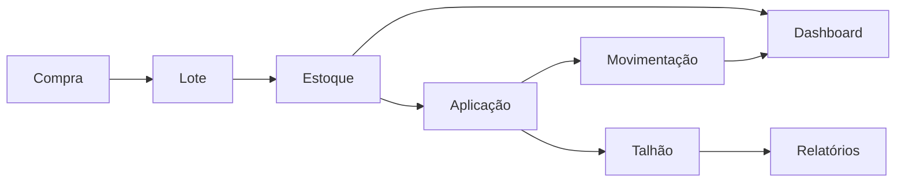

# HtoGestão — Documentação Oficial

> **Ponto de entrada** da documentação técnica do HtoGestão. Comece por aqui.
> Toda a documentação é observacional (somente leitura sobre o sistema) e reflete o estado em 2026-07-15.

---

## Resumo do sistema

O **HtoGestão** é um sistema de **gestão agrícola** voltado à cana-de-açúcar (evoluindo para multi-culturas). Ele controla o ciclo completo do insumo — da **compra** de defensivos, passando pelo **estoque por lote**, pela **aplicação** no talhão, até a **baixa automática de estoque**, o **rastro de movimentações** e a consolidação em **dashboard e relatórios**. Um app **mobile** permite ao campo registrar aplicações offline e sincronizar.

## Objetivos

- Dar **rastreabilidade** total do insumo: quanto entrou, quanto foi aplicado, onde, por quem e com que custo.
- **Controlar estoque** com precisão (baixa automática, FEFO, devolução de sobra, inventário físico).
- **Alertar** sobre vencimentos, estoque mínimo, carência e reentrada.
- Operar com **segurança por papel** (analista/supervisor, patrão/produtor, líder de campo) e isolamento por empresa.
- Evoluir para uma plataforma **multi-culturas e multiempresa (SaaS)** sem parar o produtor atual.

## Arquitetura (resumo)

Monorepo com três pacotes (web, mobile, shared) sobre **Supabase**. Padrão **“banco no meio”**: as telas falam direto com o Supabase; a lógica crítica (baixa de estoque, cálculos, segurança) vive no **PostgreSQL** (triggers, RPC, RLS). Detalhes em [`01-Arquitetura`](01-Arquitetura.md).

```
Web (Next.js/PWA)  ─┐
                    ├─→  Supabase (PostgreSQL + Auth + RLS + RPC + Edge Functions)
Mobile (Expo/RN)   ─┘
```

## Stack

| Área | Tecnologias |
|---|---|
| Web | Next.js 14 (App Router), React 18, TypeScript, Tailwind, Radix UI, Recharts |
| Mobile | Expo 51, expo-router, expo-sqlite, Zustand, react-native-paper |
| Backend | Supabase — PostgreSQL, Auth, RLS, RPC, Edge Functions (Deno) |
| Compartilhado | `@agro/shared` (tipos + utilidades) |
| Infra | Vercel (deploy web), GitHub, pnpm workspaces |

## Organização das pastas

```
agro-system/
├── docs/                    # esta documentação
├── supabase/
│   ├── migrations/001–004   # schema versionado
│   ├── functions/           # Edge Functions (import-inventario)
│   └── seed.sql
└── packages/
    ├── shared/   (tipos + utils)
    ├── web/      (app/, src/, middleware.ts)
    └── mobile/   (app/, src/services, src/store)
```

## Mapa dos módulos (web)

Dashboard · Fazendas · Talhões · Defensivos · Estoque & Lotes · Compras · Aplicações · Movimentações · Inventário Físico · Relatórios · Importar · Exportar · Usuários · Meu Perfil.

> **Ainda não existem como tela** (candidatos de evolução): Culturas (existe como dado), Configurações, Adubos (hoje são classes de Defensivos). Permissões não é tela, é mecanismo. Ver [`04-Fluxo-dos-Modulos`](04-Fluxo-dos-Modulos.md).

## Fluxo geral



---

## Como navegar na documentação

Leia na ordem numérica para uma visão completa, ou salte para o tema:

| # | Documento | Sobre |
|---|---|---|
| 01 | [Arquitetura](01-Arquitetura.md) | Visão geral, stack, pastas, camadas, fluxo FE/BE/Supabase |
| 02 | [Banco de Dados](02-Banco-de-Dados.md) | Tabelas, índices, views, functions, RPCs, triggers, policies |
| 03 | [DER](03-DER.md) | Diagrama entidade-relacionamento e cardinalidades |
| 04 | [Fluxo dos Módulos](04-Fluxo-dos-Modulos.md) | Módulos, dependências entre telas e dados |
| 05 | [Regras de Negócio](05-Regras-de-Negocio.md) | Regras RN-01…RN-15 com origem no código |
| 06 | [Infraestrutura](06-Infraestrutura.md) | Variáveis de ambiente, integrações, SPOF |
| 07 | [Deploy](07-Deploy.md) | Deploy web/mobile/edge + sync mobile |
| 08 | [Segurança](08-Seguranca.md) | Auth, autorização, RLS, fluxo de login |
| 09 | [Roadmap](09-Roadmap.md) | Fluxogramas consolidados, dívidas técnicas, evolução |
| — | [Engineering](ENGINEERING.md) | Princípios técnicos, revisão de PR, checklists |

> **Diagramas:** os fluxogramas estão em Mermaid e renderizam automaticamente no GitHub. No VS Code, use uma extensão de preview Mermaid.
>
> **Convenção `[avulso]`:** nomes de `.sql` marcados `[avulso]` foram aplicados manualmente e **não estão no repositório** — ver a nota completa em [`02-Banco-de-Dados`](02-Banco-de-Dados.md).

---

## Como contribuir

Princípios em [`ENGINEERING.md`](ENGINEERING.md). Resumo prático:

### Como criar novas telas
1. Crie a pasta do módulo em `packages/web/app/(dashboard)/<modulo>/`.
2. Siga o padrão **`page.tsx` (Server Component, busca dados)** + **`<modulo>-client.tsx` (Client Component, interface/escrita)**.
3. Adicione a rota à lista `PROTECTED` (e, se necessário, `FIELD_ALLOWED`) em `middleware.ts`, e o item no `sidebar.tsx` com os papéis corretos.
4. **Não** coloque regra de negócio crítica só no cliente — ela deve viver no banco (ver princípio em ENGINEERING).
5. Atualize a documentação (02, 04 e o que for afetado).

### Como criar migrations
1. Toda mudança de banco deve virar uma **migration versionada** em `supabase/migrations/` (numeração sequencial `00X_descricao.sql`).
2. **Nunca** aplicar mudança só no SQL Editor sem versionar — foi assim que surgiu a dívida dos SQLs `[avulso]`.
3. Ordem importa: migrations são aplicadas em sequência; não reescreva uma migration já aplicada — crie a próxima.
4. Faça **backup antes** de qualquer alteração e prefira mudanças **aditivas e reversíveis**.
5. Nunca versione scripts destrutivos junto das migrations.

### Como criar componentes
1. Reutilize primeiro: veja `src/components/ui/` e `src/components/`.
2. Extraia para componente quando um trecho se repete em ≥2 telas.
3. Tipos de dados vêm de `@agro/shared` — não redefina interfaces locais que já existem lá.
4. Componentes devem ser pequenos e com responsabilidade única.

### Como manter a arquitetura
- Respeite o padrão RSC (`page.tsx` servidor + `*-client.tsx` cliente).
- Segurança sempre na **RLS** (o front e o menu são só conveniência).
- Mantenha os tipos compartilhados como **contrato único** entre web e mobile.
- Documente toda mudança estrutural nesta pasta `docs/`.

### Padrões do projeto
- Nomes de arquivo: `kebab-case` para componentes/rotas; `PascalCase` para componentes React exportados.
- Uma fonte única por utilitário (evite duplicar funções entre `shared` e `web`).
- Idioma: interface e documentação em **português**.
- Commits: mensagem clara e profissional; nunca commitar build (`.next/`) nem `.env*.local`.

### Princípios que devem ser respeitados
1. **Segurança primeiro, performance segundo, UX terceiro.**
2. **Nunca quebrar comportamento existente** — mudanças compatíveis e reversíveis.
3. **Regra crítica nunca só no frontend.**
4. **Sempre versionar migrations.**
5. **Não duplicar** — reutilizar componentes e utilidades.
6. **Simplicidade acima de complexidade.**

---

<sub>▶ Começar pela [Arquitetura](01-Arquitetura.md) · Ver [Engineering](ENGINEERING.md)</sub>
