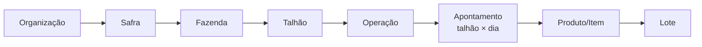

# REPORTS — Arquitetura Oficial de Relatórios, Dashboards e Exportações

> **Fonte oficial** das regras de relatórios, dashboards, exportações (Excel/PDF) e indicadores do HtoGestão.
> Toda consulta, exportação ou indicador futuro deve obedecer a este documento.
> Modo de criação: somente leitura — nenhum código, banco, migration ou exportação foi alterado.
> Alinha-se a `DOMAIN.md` (domínio congelado) e às 7 decisões de domínio. Termos: **Operação** e **Apontamento (Diário)** conforme o modelo-alvo; os relatórios legados baseados em "Aplicação" devem migrar para respeitar estas regras.

---

## 1. Filosofia dos relatórios

Três princípios inegociáveis. Se um relatório os viola, ele está errado — mesmo que o número "pareça" certo.

1. **Uma informação pertence a um único nível do domínio.** Área é do Apontamento; consumo é do Produto; saldo é do Lote. Cada métrica tem um **dono** (o nível em que ela nasce e onde pode ser somada).
2. **Nunca misturar granularidades diferentes.** Um relatório tem **um grão** (uma linha = uma unidade). Misturar níveis numa mesma soma produz números falsos — tipicamente por *fan-out* de `JOIN` (ver §7).
3. **O relatório nunca deve induzir erro de interpretação.** Se um valor aparece por contexto mas não pode ser somado, ele **não entra em linha de total**, e a coluna sinaliza isso. Preferir clareza a completude.

> Regra de ouro: **cada número é totalizado apenas no relatório cujo grão o possui.** Nos demais, ele é contextual — mostrado, nunca somado.

---

## 2. Hierarquia do domínio

**Organização → Safra → Fazenda → Talhão → Operação → Apontamento → Produto → Lote.**

Notas de reconciliação com `DOMAIN.md`:
- **Safra** relaciona-se ao **Talhão** via **Ciclo** (talhão × safra → cultura). Na hierarquia de relatório, a safra é a dimensão de tempo pela qual se agrupa o talhão.
- **Apontamento** é o grão de execução: **um talhão por dia** (decisão D1).
- **Produto** e **Lote** são o detalhe de consumo dentro do apontamento (o item aponta para produto + lote).

Descer na hierarquia **multiplica linhas** (uma operação tem N apontamentos; um apontamento tem N produtos). Toda métrica de um nível superior **se repete** quando você desce — e por isso não pode ser somada no nível inferior.

---

## 3. Granularidade oficial (o grão de cada relatório)

Cada relatório tem **exatamente um grão**. Uma linha = uma unidade do grão.

| Relatório | Grão oficial | Uma linha representa | Somável na linha |
|---|---|---|---|
| **Financeiro / Custo** | **Operação** | uma operação (com seu custo total) | custo total, nº de apontamentos |
| **Consumo** | **Produto** | um produto (qty consumida) | quantidade, custo do produto |
| **Histórico** | **Apontamento** | um dia de trabalho num talhão | área do dia (por apontamento) |
| **Estoque** | **Lote** | um lote de um produto | saldo, valor |
| **Custo por Talhão** | **Talhão** (agrega Operações) | um talhão na safra | custo total; área **via DISTINCT apontamento** |
| **Custo por Safra** | **Safra** (agrega Talhões) | uma safra | custo total; área tratada agregada |
| **Carência / Reentrada** | **Apontamento × Produto** | uma restrição ativa | — (nunca somar) |

> Se um relatório precisa de dois grãos (ex.: custo por operação **e** consumo por produto), são **dois relatórios** (ou duas abas), não uma tabela só.

---

## 4. Métricas — nível, somabilidade e agrupamento

Taxonomia de somabilidade:
- **Aditiva** — pode somar em qualquer nível **igual ou acima** do seu grão.
- **Semi-aditiva** — soma em algumas dimensões, não em todas (ex.: estoque soma entre produtos, mas não entre "fotos" de datas — é um instantâneo).
- **Não-aditiva** — nunca somar (razões, doses, contagens regressivas). Recalcular no nível de agregação.
- **Contextual** — pertence a outro nível; aparece por referência, **proibido totalizar**.

| Métrica | Nível (dono) | Somável? | Agrupável por | Observação |
|---|---|---|---|---|
| **Área realizada (ha)** | Apontamento | Aditiva **no grão Apontamento/Operação/Talhão/Safra**; **Contextual** no grão Produto | Talhão, Operação, Fazenda, Safra | Duplica se juntar com produtos → somar sempre com `DISTINCT apontamento` |
| **Área operacional (ha)** | Apontamento | igual à área realizada | igual | `= área realizada × (1 + acréscimo%)`. É apoio de **dose**, não de contabilidade (decisão D2) |
| **Quantidade consumida** | Item (Produto×Lote) | Aditiva | Produto, Operação, Talhão, Safra | Aditiva no grão Produto |
| **Custo de produto (R$)** | Item | Aditiva | Produto, Operação, Talhão, Safra | `qty_usada × preço do lote` |
| **Custo total da operação (R$)** | Operação | Aditiva | Talhão, Fazenda, Safra | Σ custos dos itens (+ custo operacional futuro) |
| **Custo por hectare (R$/ha)** | Derivado (Operação/Talhão) | **Não-aditiva** | — | Razão. **Recalcular**: `Σ custo ÷ Σ área tratada` no nível. Nunca somar nem "média de médias" |
| **Dose por hectare** | Item | **Não-aditiva** | — | Informativa; se agregar, média **ponderada por área** |
| **Saldo de estoque** | Lote | Semi-aditiva | Produto, Local | Soma entre lotes/produtos; é instantâneo (não somar entre datas) |
| **Valor de estoque (R$)** | Lote | Semi-aditiva | Produto | `saldo × preço` |
| **Nº de operações / apontamentos** | Operação / Apontamento | Aditiva (contagem) | Talhão, Fazenda, Safra | Contar `DISTINCT` a entidade correta |
| **Carência (dias restantes)** | Apontamento × Produto | **Não-aditiva** | — | `data do apontamento + carência do produto`; informativa (decisão: por data do apontamento) |
| **Reentrada (horas restantes)** | Apontamento × Produto | **Não-aditiva** | — | `data do apontamento + reentrada`; informativa |
| **Princípio ativo / classe** | Produto | Contextual (dimensão) | Produto, Talhão (histórico) | Dimensão de agrupamento, não medida |
| **Estágio da cultura (planta/soca/corte)** | Talhão × Safra (Ciclo) | Contextual (dimensão) | Talhão, Safra | **Não** é dimensão de produto nem de alvo (ver §7) |

**Exemplo canônico — Área:**
- Pertence à **Operação/Apontamento**.
- Pode ser somada **apenas** em relatórios de Operação/Apontamento/Talhão/Safra.
- Em relatórios de **Produto** é **apenas contextual** e **nunca** deve ser totalizada.

---

## 5. Regras de exportação (evitar duplicidade de área em mistura de tanque)

**O problema.** Um apontamento (talhão × dia) pode aplicar vários produtos de **um mesmo tanque de calda** sobre, digamos, 14 ha. Ao exportar por produto (`apontamento → itens → produtos`), a área de 14 ha **se repete em cada linha de produto**. Somar a coluna dá 42 ha para 14 ha reais — erro clássico de *fan-out* de `JOIN`.

**Regras.**
1. **Uma aba por grão.** A exportação usa abas separadas: `Operações`, `Apontamentos`, `Consumo por Produto`, `Estoque`. Cada aba soma apenas o que é dono do seu grão.
2. **Área só totaliza na aba de Apontamento/Operação.** Na aba de Produto, a área aparece como **coluna de contexto** (a do apontamento), **sem linha de total** e idealmente marcada "(contexto)".
3. **Total de área sempre com `DISTINCT apontamento`.** Nunca somar área a partir de uma consulta que já explodiu por produto.
4. **Numa aba de Produto, se a área precisar aparecer**, mostrá-la só na **primeira linha de cada apontamento** (linhas seguintes em branco) — nunca repetida como se fosse área independente, e nunca em `SUM`.
5. **Razões (custo/ha, dose/ha) nunca são exportadas somadas.** São recalculadas na linha de total do nível: `Σ custo ÷ Σ área`.
6. **Cada métrica tem um total só, no lugar certo.** Se um número aparece totalizado em duas abas, uma delas está errada.
7. **PDF segue as mesmas regras do Excel.** O layout muda; o grão e as somas, não.

---

## 6. Indicadores oficiais

Definições canônicas. Qualquer tela/exportação deve calcular assim.

| Indicador | Fórmula oficial | Grão | Somabilidade |
|---|---|---|---|
| **Área tratada** | `Σ area_realizada` sobre `DISTINCT apontamento` | Apontamento | Aditiva no grão dele; nunca via produto |
| **Custo por hectare** | `Σ custo ÷ Σ área tratada` (recalculado no nível) | Derivado | Não-aditiva |
| **Consumo por produto** | `Σ quantidade_usada` agrupado por produto | Produto | Aditiva |
| **Estoque** | `Σ lotes.quantidade_atual` por produto (instantâneo) | Lote/Produto | Semi-aditiva |
| **Histórico** | lista de apontamentos do talhão, ordenada por data | Apontamento | — (listagem) |
| **Carência** | `data_apontamento + carencia_dias`; dias restantes se futuro | Apontamento×Produto | Não-aditiva (informativo) |
| **Reentrada** | `data_apontamento + reentrada_horas`; horas restantes se futuro | Apontamento×Produto | Não-aditiva (informativo) |

Notas:
- **Área tratada** usa a **área realizada** (hectares reais cobertos), não a área operacional (que é buffer de dose — decisão D2).
- **Custo/ha** é a razão do nível agregado; ao somar talhões numa safra, some custos e áreas separadamente e **divida no fim** — jamais some razões.
- **Carência/Reentrada** derivam da **data de cada apontamento**, não da abertura da operação (decisão de domínio) — senão o alerta fica errado.

---

## 7. Anti-patterns (proibidos)

Registrados explicitamente. Um PR que faça qualquer um destes deve ser recusado.

- ❌ **Somar área em relatório de Produto.** A área do apontamento repete por produto; somar duplica (fan-out). Área só soma no grão Apontamento/Operação, com `DISTINCT`.
- ❌ **Duplicar métricas por causa de `JOIN`** (*fan trap / chasm trap*). Juntar 1→N infla as medidas do lado "1". Agregue cada medida no seu grão antes de juntar, ou use subconsultas/`DISTINCT`.
- ❌ **Misturar estágio da cultura com alvo/classe do produto.** Estágio (planta/soca/corte) é dimensão do **Talhão×Safra**; alvo (praga/daninha/doença) é da **Operação**; "biológico" é **classe do Produto**. São eixos diferentes, de níveis diferentes — não podem virar a mesma coluna de agrupamento nem ser comparados como se fossem.
- ❌ **Somar razões** (custo/ha, dose/ha) ou fazer "média de médias". Recalcular no nível.
- ❌ **Misturar grãos numa tabela só** (linhas de produto + linha de total de área). Separe por aba/seção.
- ❌ **Somar saldo de estoque entre datas** (é instantâneo, não fluxo).
- ❌ **Totalizar métrica contextual.** Se a coluna é de outro nível, ela informa — não soma.
- ❌ **Relatório que induz interpretação dupla** (mesma métrica somada em dois lugares com valores diferentes).

---

## 8. Relação com o restante da documentação

- **Domínio:** `DOMAIN.md` (talhão como raiz; Operação + Apontamento; custo/estoque/alertas como derivações).
- **Decisões congeladas:** grão talhão×dia (D1), acréscimo informa dose e não baixa (D2), carência/reentrada por data do apontamento.
- **Engenharia:** `ENGINEERING.md` (revisão de PR deve checar estes anti-patterns).

**Ao aprovar**, este documento deve ser vinculado a partir de `MASTER.md`, e os relatórios legados (custo por talhão, aplicações, executivo, vencimentos) auditados contra as regras acima — em especial a soma de área e as razões custo/ha.

---

Documento de arquitetura de relatórios · criado em modo somente-leitura, sem alterar código, banco, migrations ou exportações. Referência obrigatória para toda consulta, indicador e exportação futura. Ver também [DOMAIN](DOMAIN.md) · [ENGINEERING](ENGINEERING.md) · [MASTER](MASTER.md).
